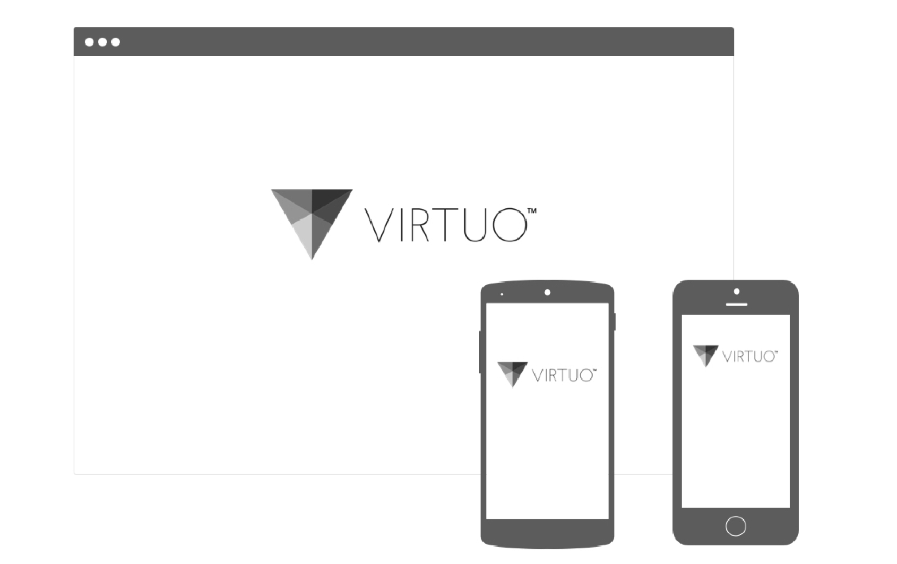
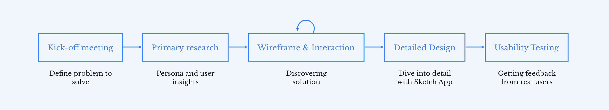
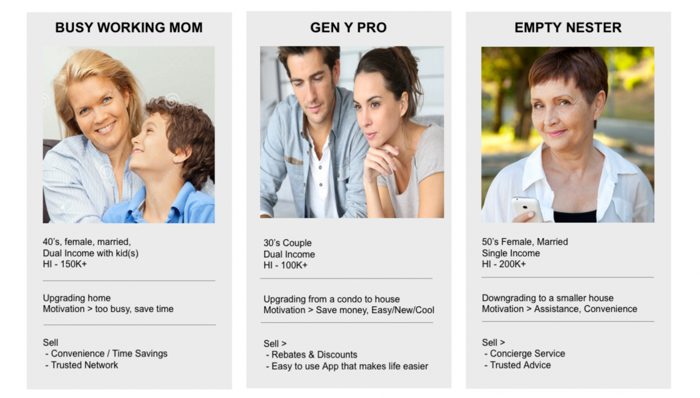
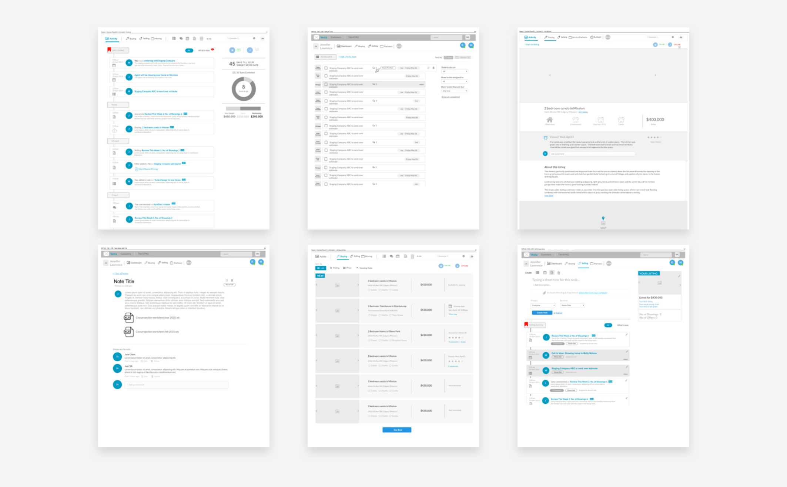
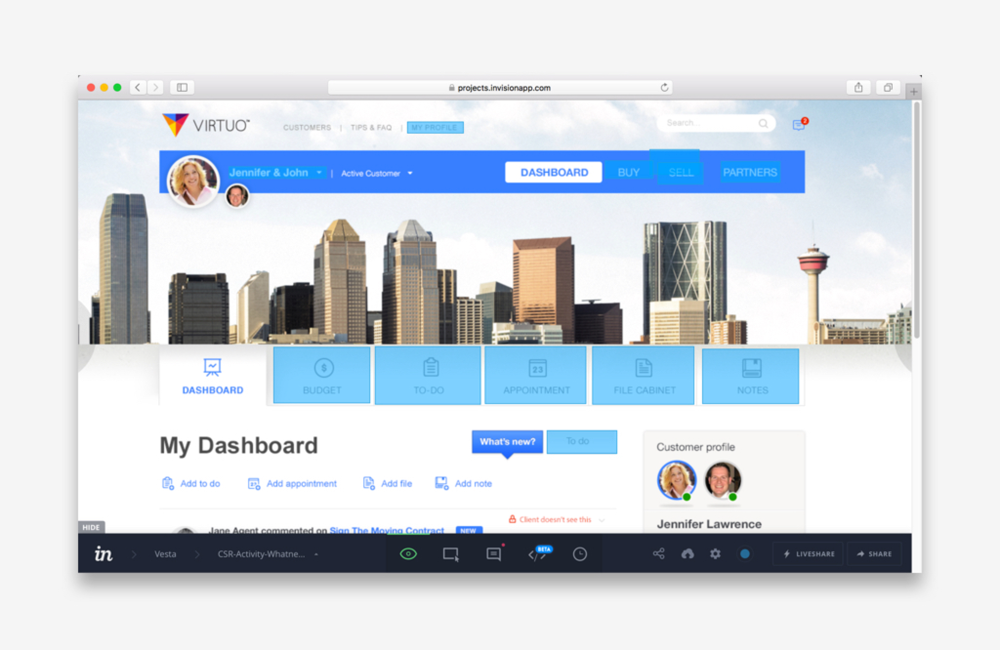
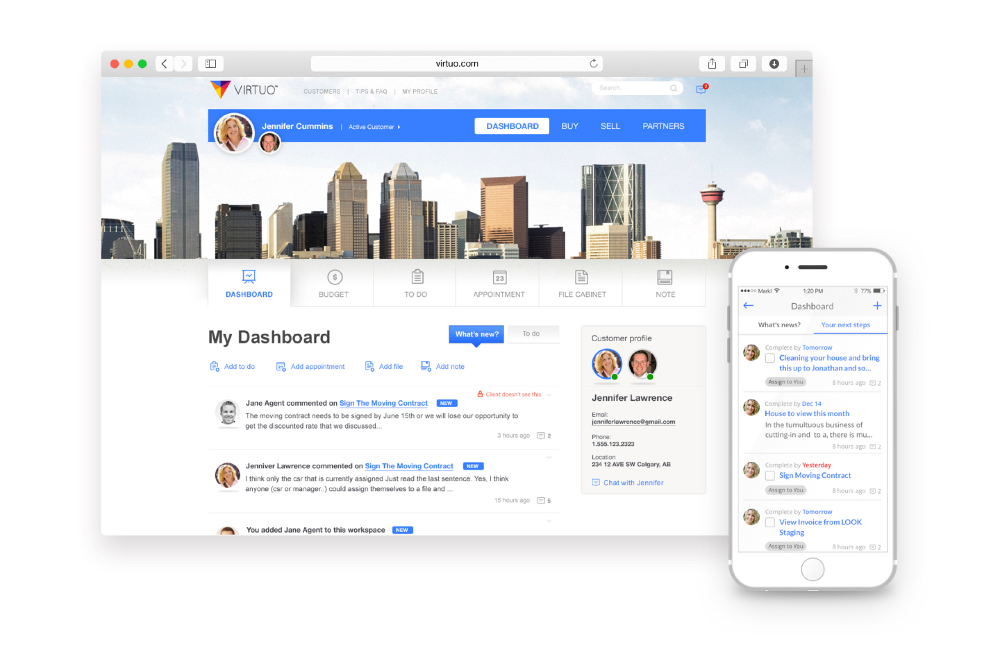
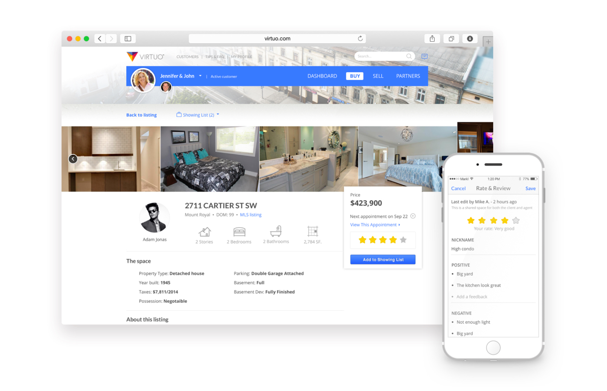
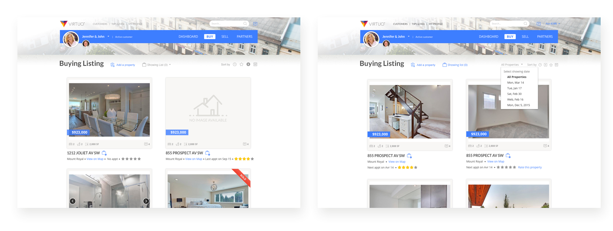
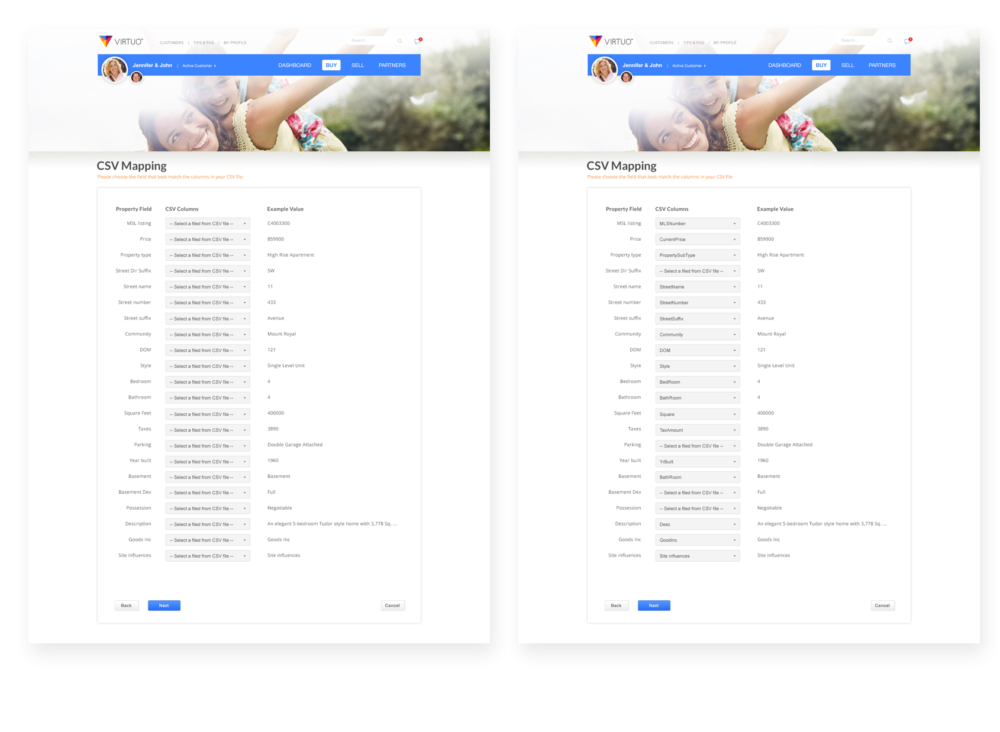

## My roles
I was part of a design team of two and responsible for the experience strategy and design of the Web and the mobile app (iOS and Android). I produced wireframes, all interfaces and interactions between April 2015 and March 2016.

I worked alongside a UX Lead who focused on the research and strategy, and the development team.

  

## Design process

  

###### Chalenge
## A complex app for homeowners and service providers

Our client approached us to help them design and develop a product that aims to take care of everything from real estate to mail forwarding.
With two primary objectives:

* To design and build a web, iOS and Android application that handles everything from finding a realtor to setting up mail forwarding in a more effective and meaningful way for homeowners and representatives.

* To provide a CRM that helps management team manages their customers, Service Providers, and staffs.

  

###### The approach
## A complex app for homeowners and service providers

Our lack of domain knowledge in moving and relocation meant we needed to understand the nature of moving service thoroughly and quickly. We approached all aspects of the project collaboratively through Google Doc and meeting remotely.

This approach was necessary to understand the problems, the user’s needs and the goals of the business.

### Customer insights

Insights from our discovery work indicated many areas. We needed to provide a more holistic solution that considered our users needs relating to:

* Find the right realtor to get the best deal / to prepare the house for sale.

* Have personal assistance to help homeowners prepare any stuff and do any paperwork that relates to their relocation.

* Connect homeowner with the best and trusted Service Providers.

  

### Wireframe, UI and interaction

  

My process involved sketching and wireframing concepts and flows with my UX Lead and my PM. The designs were updated accordingly as we made iterations and meeting with our client.

  

Since I was working with many existing design patterns, it was relatively eaay to move straight into hi‐fidelity designs.

My next step involved uploading to InVision to create a prototype. Prototyping was the most effective way to gain meaningful feedback from the team, consensus from stakeholders and approval from senior leadership. I was able to easily distribute these as videos and recycle them for Usability Testing.

  

- - - -

###### Detailed designs
# Introducing Virtuo
The gallery below shows the final Web and iOS app for customers and the CMS for the management team.

  

### Dashboard

Manage all activities, includes the appointments between homeowners with CSR and service providers, to-dos, file cabinet, note, budget.

  

### Buy and sell

Scheduling appointments, co-ord.

  

### Service provider

Help homeowner find the best realtor and other service providers.

  

### CRM

Manage all service providers, customers and staff.

  

###### The refinement
## Usability testing

The usability test will address key questions that the team needs answers to ensure the application is usable and useful to the customer.

All of our customers live in Canada, so we did by doing unmoderated remote testing using Validately.

#### Understand agent’s need

Almost all the agents expressed the desire to see properties listed by what’s been viewed and not viewed. They want an easy way to organize and manage homes that have been viewed by appointment.

We decided to add a way to display property by Appointment.

  

#### Fixing adding properties process

Realtors did not like the idea of having to manually upload spreadsheets and felt it could be enough of a reason to not want to use the app. And the field validation step was confusing.

To make it more usable, we decided to remove the field validation step, all the fields will be matched automatically.

  

###### Styleguide
## Consistency and Communication

I created a style guilde to make the design stay consistent and for the developers in our team easier to set up and work.

  

### Links

[Visit the site →](http://virtuo.com/) / [Download iOS app →](https://appsto.re/ca/kt3Pgb.i) / [Download Android app →](https://play.google.com/store/apps/details?id=xc.com.codeenginestudio.virtuo&hl=en) 
