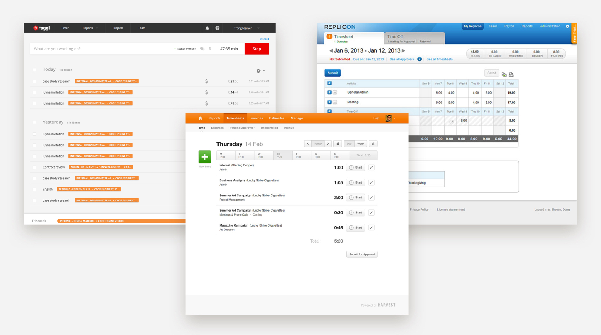
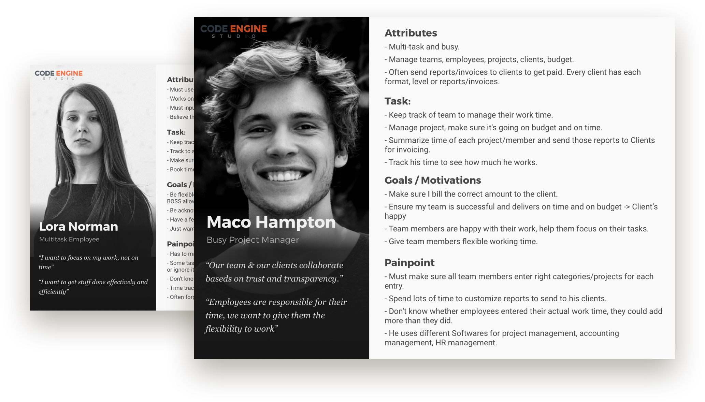
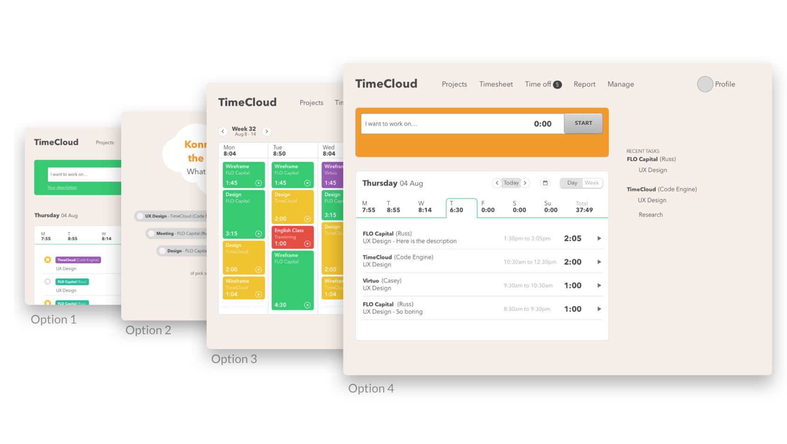
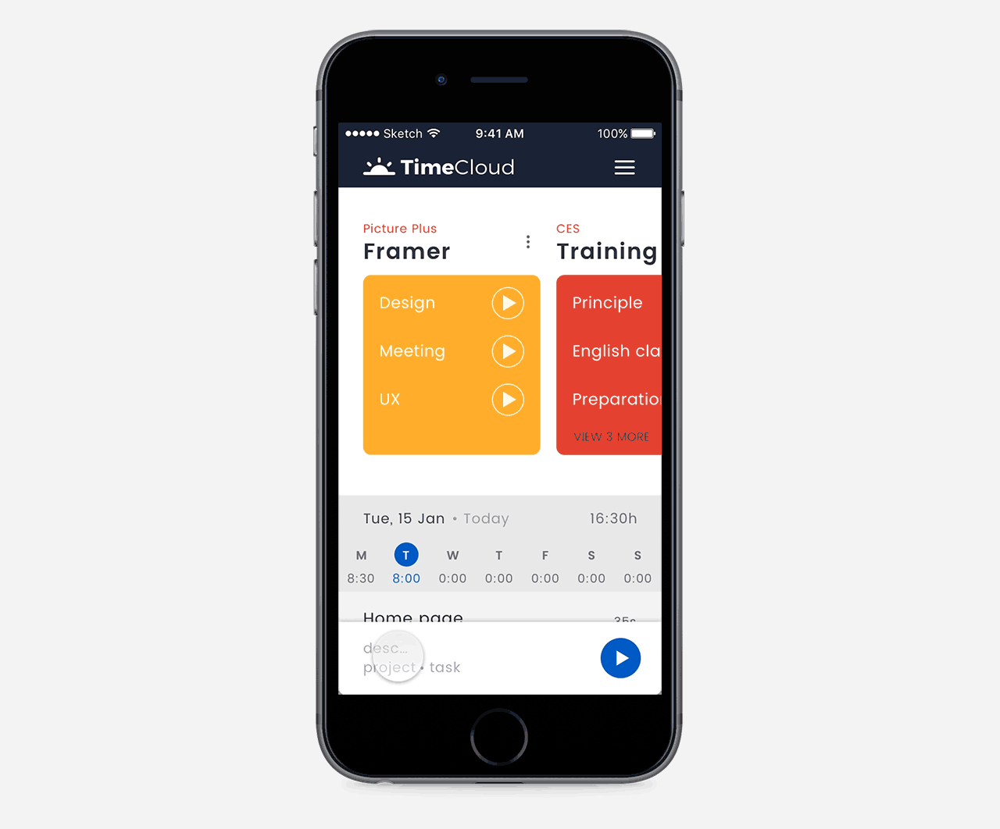
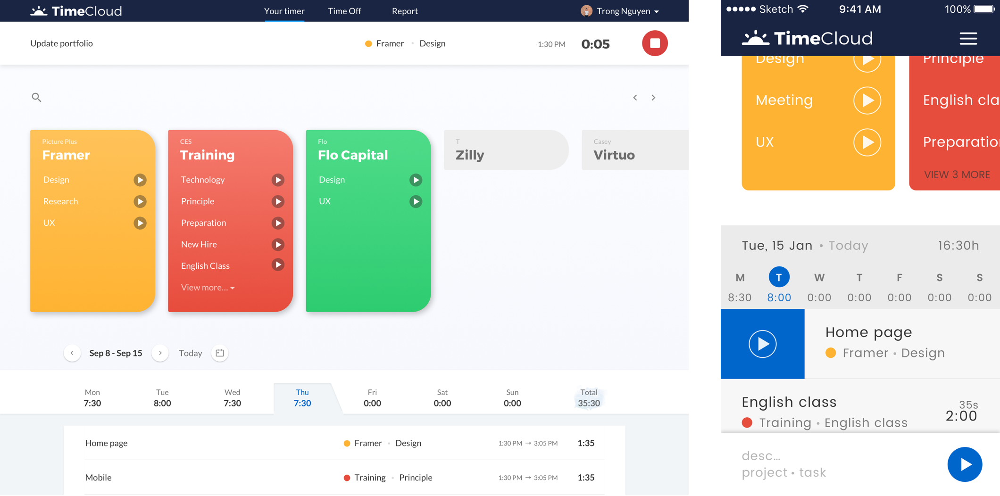

##### Process

  

## Define problems
At Code Engine Studio, we work with many clients, many web & app projects and many team members, we need to track time and get paid from clients.

We tried to used different app to track our time, some of them are very expensive, some are cheaper, tracking time easier but we must spend 4 hours/week to do a report on Google Sheet.

We think we can create a better app that focuses on ease of tracking time and good reports.

## Market research & Competitive analysis
We did some market researches to see how people are tracking and managing time in a team and verify that whether our idea resolves real problems.

We also analyzed our competitors who are in the market to find their strengths & weaknesses. We got three competitors:

  

## User interview and user testing on a competitor
Who are our target customers and what are they doing?

We found out two customers: Product Manager (primary one) and Team Member.

To understand them more, we did one-to-one interviews with six participants and watched them interact with Toggl (one of our competitors) with usability testings.

### Personas

From the information we got from user interview and test, we built personas that remind us who we are designing for.

  

### Customer journey map - CJM

A CJM shows us the story of our customer when interacting with our product: where they come from, what they do, where they get stuck, any pain-point, their feelings when using the app.

When you see the map, you may know where we can improve to make the product better, by making our users happier.

CJM is really powerful.

  

## Ideate, sketch & wireframe

In this phase, I did brainstorming with my director to come up with as many solutions as possible and then chose the best ideas.

  

After picking up some ideas, we moved to do detailed wireframes. And of course, with many other ideas:

  

## Create prototype
> “If a picture is worth 1000 words, a prototype is worth 1000 meetings.”  

We built a clickable prototype with Marvel. With this prototype, we used it like a real product to see whether it痴 good and also used it for our usability testing.

Very first prototype:

  

## Usability testing

We invited five people to do usability testing. We watched them interact with what we created, asked them questions and get feedback from real users.

This step would help us verify our idea, make sure our users can use easily, and especially, reduce the cost of changes on development phase, we want to make our developers happy by reducing changes.

  

- - - -

###### Hifi Design

# Introducing Time Cloud
When the idea was verified, we confidently dive deeper into the detail of the final design. Here are some features of our product:

  

### Tracking time

Start tracking by one click, with many different ways.

  

  

### Time off

Request and manage time off.

  

### Time off management for PM

  

### Projects

Manage team and projects for the PM.

  

### Report

Run report based on projects, person, time span.

  

