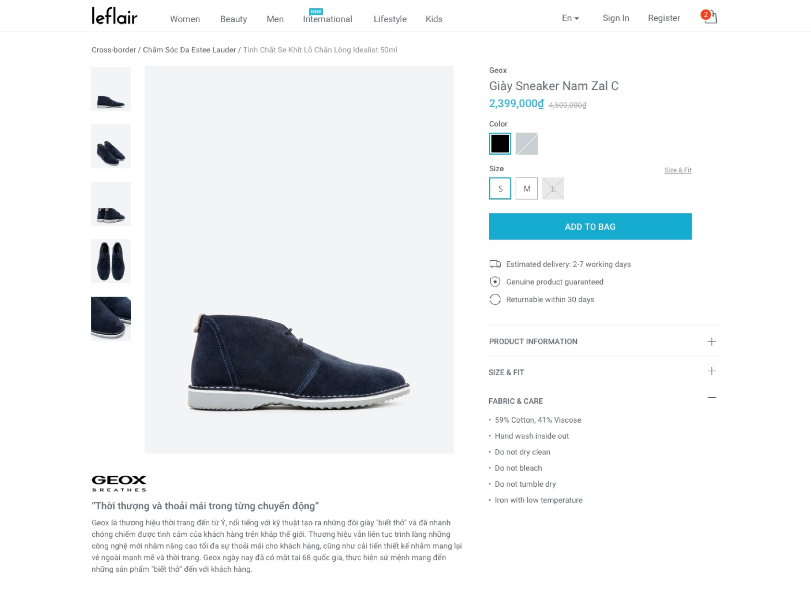
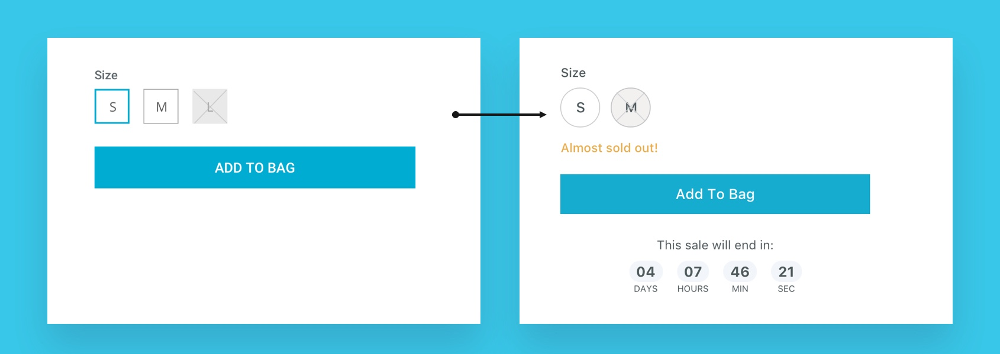
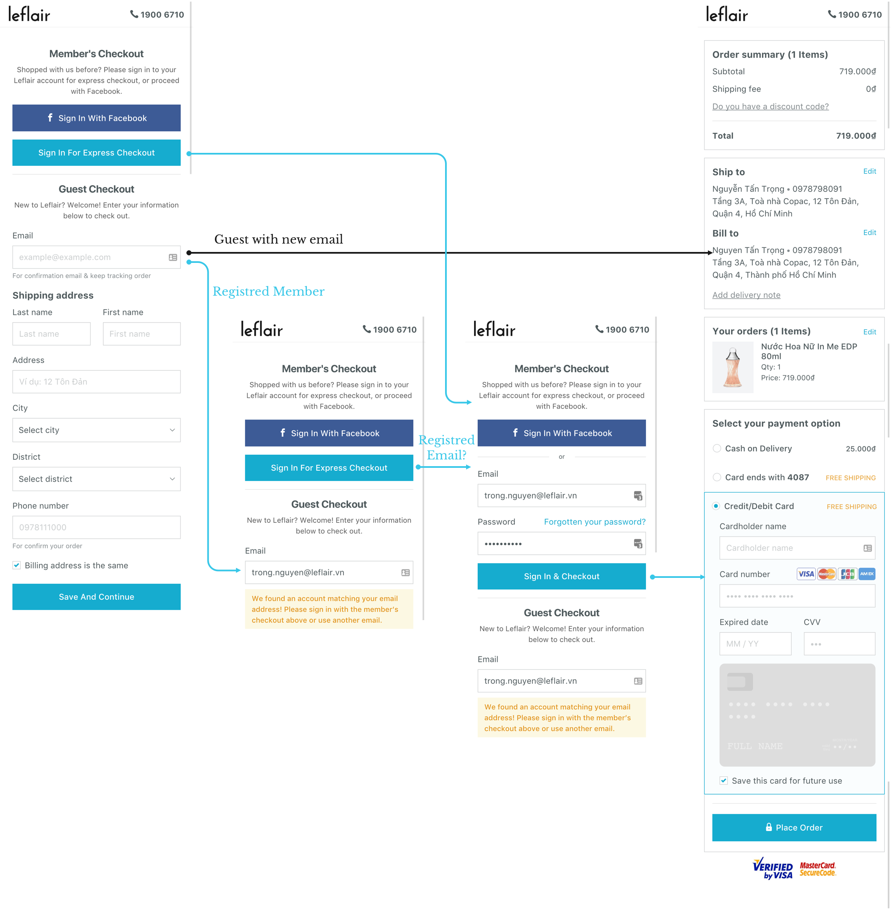
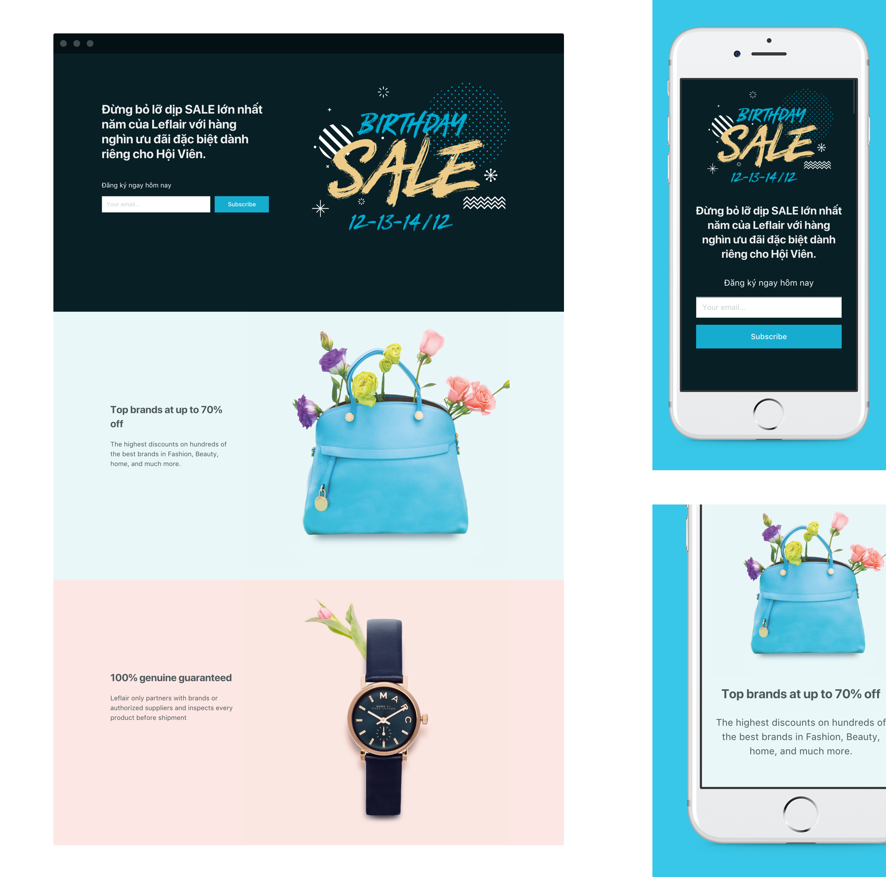
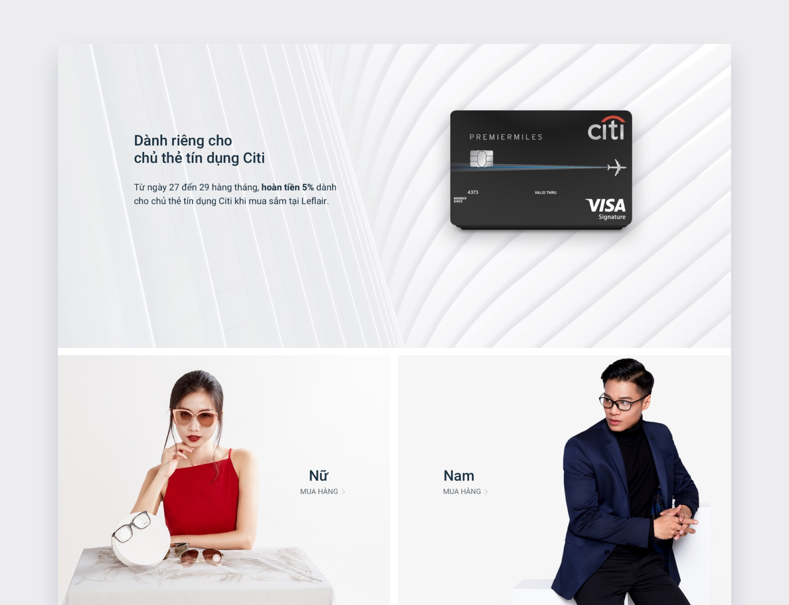

Leflair is a young e-commercial site who brings authentic brands to Vietnamese People, focus on fashion, beauty, and home.

The differentiator of Leflair is they sell luxury products to customers with a low price, doing that by helping partners clear their inventory faster.

In a small product team with 3 developers (include CTO) and me - the only designer. I’m responsible for the experience of customers on the site.

When you work in a startup, you will do many works: user research, AB test, wireframing, UI, social media & email marketing guideline, package design,… and coding also!

What did I do?

## 1. Improve product detail

### Old product page:

  

It’s a very basic product page that we can see on many e-commerce sites. But it doesn’t provide enough information to persuade customers to buy things. They are:

* Color selection is poor. When using a solid color to represent other color options, but people can not imagine how it looks like until they click on an option.

* Missing some “urgent” signs. When almost all products are sold in limited quantity (around 1 to 3), but the site showing nothing to inform people. We missed a very important element to persuade people to buy stuff.

* Estimated delivery time is just a general message, “Delivery in 3 - 7 working days” is not useful, people must open the calendar to see which day, after spending a couple minutes, they just realize they will have a vacation on that day, they leave the site.

### New updates

From those insights, I did some research on other competitors, read many reports and best practice for a product page, I decided to update our page.

  

With the new product page, instead of a generic color swatch, we used real image thumbnail, with this, people easily choose their favorite color.

  

To add urgency, we shown messages like “Almost sold out”, “Only one item left” and a countdown clock to highlight our sale has limited time.

  

General estimated delivery time was updated for specific days.

  

### Result

Add to cart Conversion rate increase from 2.04% -> 4.12%

# 2. Improve checkout process
The first version of leflair.vn is a private website which is only for members. So the checkout process is very simple:

  

After one more year of running, we see the opportunity to open the site for everyone, make it more accessible to new customers. Our team needs to work on new checkout process.

First version of checkout:

  

We launched the 2nd version of the site with that process in June 2017.

Result: Conversion rate decreased 50%, revenue decreased 30%.

### Something need to change

From data on GA and Hotjar (Heatmap recording), we knew that we need to make the checkout process easier and clearer for our customer.

New checkout process:

  

### Result:

Revenue: +30%, checkout conversion rate: +40%

## 3. Dive into coding with AngularJS and ReactJS
In a product team with just 3 devs and 1 designer, we must take care both the CMS (manage inventory, customers, products,…) and the e-commercial site, we move very slow.

Some details on the site were ignored, some updates were pending, some new features were waiting inline. Because we had a limited resource.

With a basic knowledge of CSS & HTML, I joined the dev team to work on some CSS stuff and landing pages that no need much deep knowledge in development.

The site was first built with AngularJS, but after the first release, the speed is very slow. After some tries but the speed didn’t improve, our CTO decided to break it and built it from scratch, with ReactJS.

I was involved in development from the first release, so I took time to get familiar with Angular first, and after with ReactJS. Here are some pages I worked on designing and coding:

  

  

  

