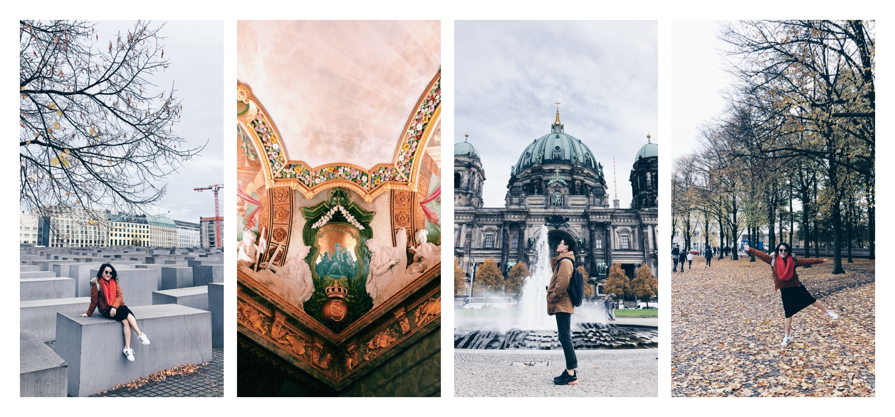
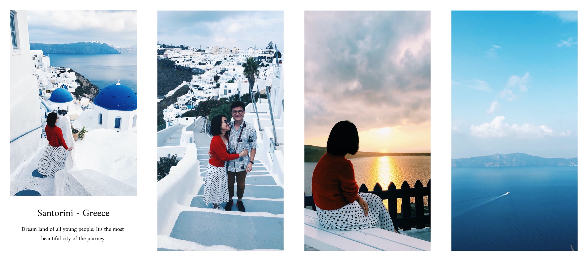
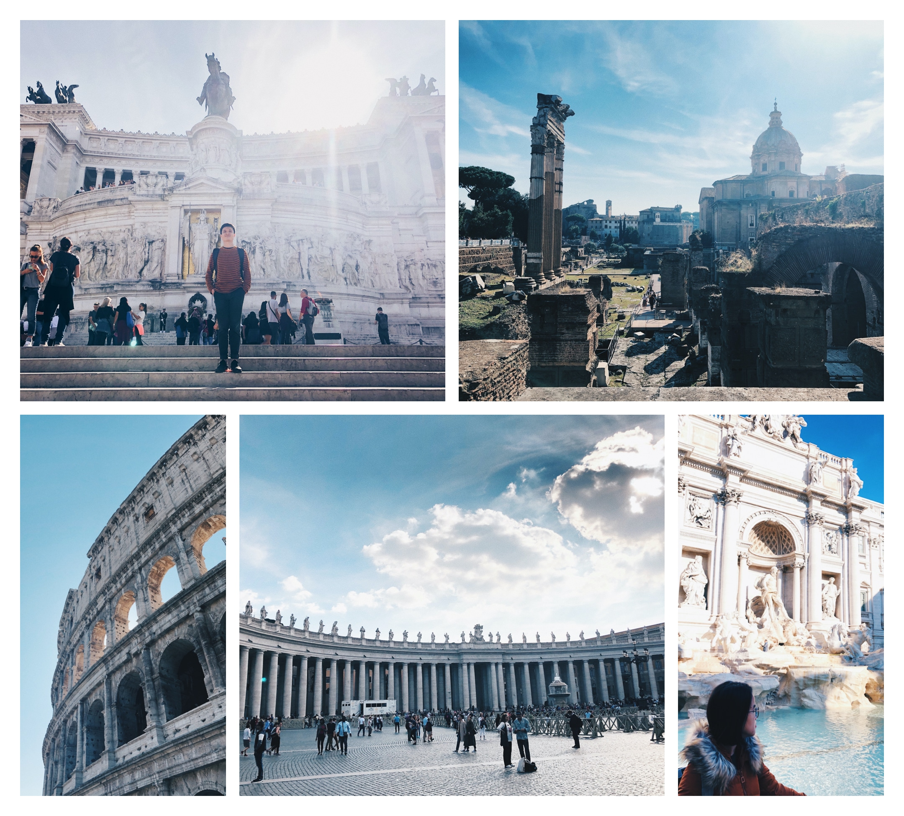
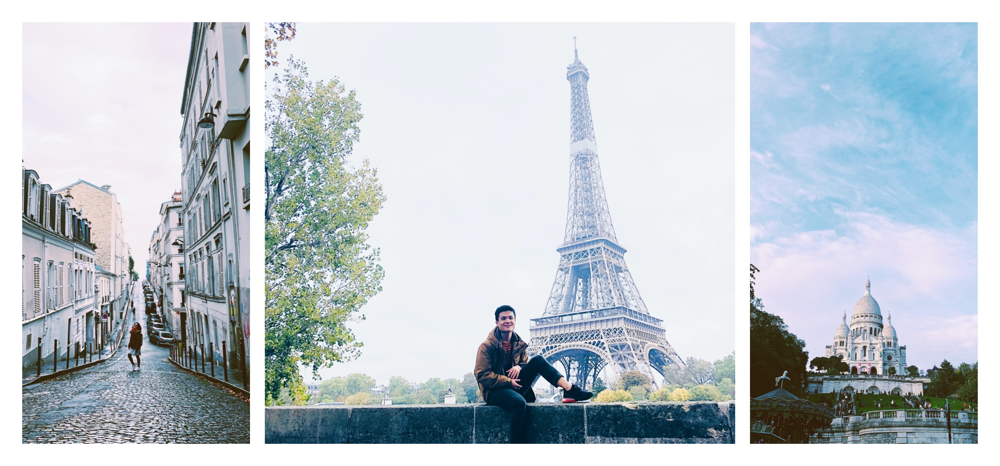

3 weeks ago, we were pulling luggage to the airport for the first trip to Europe. Going to Europe is the dream that I always dream of.

Remember the day that I decided to learn French when I decided to join the French - Vietnam program of the computer science faculty to find a chance to go to France with a scholarship. I knew that French isn’t good for a software engineer, but I still chased it. Getting a job after graduating wasn’t my main reason. My bigger purpose was to come and stay in France.

Five years later, I was still in Viet Nam with a job as a UI/UX designer and all four of my good friends was studying in France with their scholarships.

I was not that bad. Something had changed for five years in school. First, I realized that I had to know English to work in the tech industry. Second, if I got the scholarship, I had to study computer science which wasn’t the thing I wanted to work. So I had missed the chance to go to France, a free one.

Four more years had passed, I was sitting under the Eiffel tower, and I did it by myself. I felt so proud of it. Someone said that we could make the dreams come true in many ways. And I chose a different way and finally, I reached it.

Now I will tell you about our journey to Europe.

On the trip, we planned to go to 5 different countries, 8 cities in 18 days. We would start from Berlin to Cologne (Germany), Brussels (Belgium), Paris, Nice (France), Rome (Itali), Athen and Santorini (Greece) then back to Athen to take the flight back home.

Many friends said that it was too many many places and would be very tired. We’d known it, but we still went with that plan. Because that was the first time we go to Europe, we wanted to go wide, not go deep.

In general, Europe is very beautiful, as we saw on TV, movies, photos. But different countries have different beauties.

I’m going to list down our highlights of the trip: the best and the worse city, city to visit again, the best food,…

### The best city: Berlin, Germany

  

I was very surprised by the German people. It was the first time we come to the city, we often tinkered away on the street, didn’t know how to buy a ticket, how to use the metro, which direction we should go. And some people just came to us and asked: “Do you need help?”.

I always thought that the Europeans are very cold and busy. They just care about themself. Children don’t stay with their parents, parents pull the kids out of the house when they are 18 years old.

But when we came there, things were so different from our imagination. I love German people, as so Berlin.

### The most beautiful city: Santorini, Greece

  

I’m thinking between Santorini and Nice for this category. Both are beautiful and have different beauties. But Santorini gave me more memories.

I will not forget the sunset in Oia. The shadow of the sun spread from the horizon to my feet. Color turns from blue to yellow to orange then to peach.

There are not many blue domes like we see in all photos of Santorini. White houses grow on the top of the island like snowdrops settle on the mountain during winter.

And Santorini has an endless ocean.

### City with the best food: Bonn, Germany

  

You will laugh at me when you hear the food I love the most. For real, it’s the best food on our trip: bún cá - Vietnamese fish soup noodle.

Yes, I didn’t type wrong, it’s a Vietnamese food in Germany. I’ve never eaten a  tasty noodle soup good like that before, even in Vietnam.

We always looked for Vietnamese food in any place we visited. We couldn’t eat local food all day long, because it didn’t fit our taste. So in a day, we tried one mean with local food and the other one with Vietnamese food.

If you love Vietnamese cuisine and visit Bonn someday, this this delicious restaurant [May May](https://www.google.com/maps/place/May+May/@50.7342824,7.1019195,15z/data=!4m2!3m1!1s0x0:0x39091382b34ede56?sa=X&hl=en&ved=2ahUKEwiEqoLp0YrmAhWhIbcAHSIbCMoQ_BIwE3oECBwQCA).

### City with the best coffee: Rome, Italy

  

I love coffee. That’s why I put this category in.

I was very surprised when having breakfast in a restaurant in Rome. It was a small restaurant but there were many people there. They were standing in front of the waiter’s desk, eating croissants, drinking some cappuccino and talking to each other.

In the digital age, you will not see that so often. And I understood why Italian coffee shops inspired Howard Schultz to build Starbucks's coffee experience.

Rome has the best cappuccino in my life, and also the best croissant ever, it’s in Rome, not any place in France.

### City I will visit again: Paris

  

We usually spent 2 days for each city. It was enough time to visit the most scenic places in the city. Not for Paris.

There were many places that we couldn’t visit in Paris: the Louvre museum, the castle of Marseille,… My friend in Paris said that we had come to the Louvre museum around ten times, but it had been very different every time he had visited. “We have to spend three months to visit the whole museum,” he said.

---

That’s the highlight of the trip. Now you might ask me what are the experience for people who are going to visit Europe. Here is some advice I can give to you.

- **Fewer destinations:** Unless you are a backpacker, go to fewer countries will be a better idea. On this trip, we had to commute a lot: by train, by plane, by bus,… It’s not too tiring because we spent at least two days in each city. Not too tired, but a bit tired, especially my fellow, my wife. Spending more time to rest, relax and sleep.

- **Bring smaller luggage:** Our luggage is small (actually, it’s very small for an eighteen days trip). But if possible, get smaller luggage with you (40x20x30cm). Some airlines have a frame to measure the size of the luggage. They just allow the one that fit their frame. We were fined E60 because one luggage didn’t fit their frame, the one which was 40 x 25 x 30cm! They were very petty but we better prepare, instead of losing money and complaining about them.

- **Eat more local food:** Maybe they are not tasty but experience it so you have something to tell to your friend after the trip. About how bad German food was. We ate too many Vietnamese foods in Europe and missed the chance to try local food. But we stayed too long there, we needed to eat food foods to be healthy, to have the strength to travel.

- Last but not least, **book a closer place to stay:** In a couple of cities, we booked a room that was very far from the center. It took more than 30 min to go to the center. It was cheaper, but too much effort. Even the room is more beautiful, cleaner and nicer, just the distance was too far.

That’s all. We wrote this post for ourselves to read someday in the future. But hopefully, it’s useful for you, to have a good vacation in the future,

Cheer,
Trong & Truc