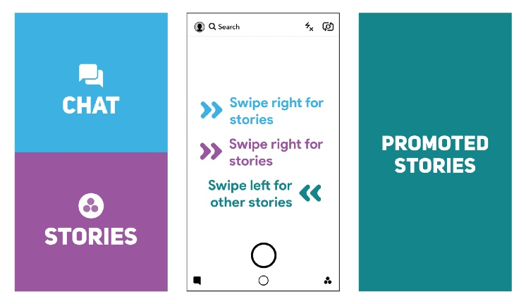

In early 2018, Snapchat rolled out a major redesign. They launched a reformatted layout, which in turn confused users by making it difficult to access features they used daily.

It’s a drastic departure from previous designs and was supposed to make the app simpler to use. Unfortunately, a lot of people found it to be a confusing mess.

### Old Snapchat

* Left: Messages in reverse chronological order

* Right: Stories from everyone in reverse chronological order with a carousel of ranked preview tiles in a carousel above or below Stories

* Auto-Advance: Automatic and instant

  
  <figcaption>Old Snapchat</figcaption>

### Redesigned Snapchat

* Left: Messages and Stories from friends mixed together sorted algorithmically

* Right: Discover, sorted algorithmically, with influencers and people who don’t follow you back mixed in

* Auto-Advance: Interstitial preview screens

  
  <figcaption>Redesigned Snapchat</figcaption>

They failed because they changed the designs that their users are familiar with. With the new release, users had to learn new things, new behaviors. They broke their mental model. Then their users moved to the competitors: Instagram, Facebook who had copied the old Snapchat’s design & feature.
Snapchat ignored one common principle on UX: Jakob’s law.

What is Jakob’s law about? It states that:

> "Users spend most of their time on other sites, and they prefer your site to work the same way as all the other sites they already know."

This principle encourages designers to follow common design patterns to avoid confusing users, which can result in a higher cognitive load.

Now let go to some eCommerce websites: Amazon, Zappos, Flipkart, Lazada,… you will see their product detail page are almost the same: image on the left side, some key information with action buttons on the right, under is richer detail and related products.

They are the same not because they copy each other. It’s because they know their customers use other sites, and they don’t want them to have to learn new things when coming to their website. They want the customers to find information as fast as possible by keeping the same structure. The faster customers get the product info they need, the higher chance they purchase it.

Then you can come up with thinking: “Why they are so boring?”
Yes! Similarity is boring. But remember that we’re designers and design for our users, not for us. We can think that those websites aren’t creative and boring. Customers come to a website with a purpose. A young man comes to Sephora.com to buy a lipstick for his girlfriend, not to come to see how beautiful the website is.

Nowadays, all the popular tech company turns their apps to a white boring color: Facebook, Twitter, Pinterest, Medium,… Why?

If we know Jakob’s law, it makes total sense. You might say that they are lazy and copy each other. No, they do with purposes, to help their customers use the app easier and focus on the content.

Then how do they differentiate between each other? Be different in small details.

We can play around with secondary colors that support the brand color, trying different icon styles, pick a different font that aligns better with the brand or use a different tone of voice and many other details that we can do differently.

Day by day, hundreds of products are born. People will have more choices and more apps on their phones. That’s why we need the make the app simple. Using the most common pattern for our product helps customers use our product easier. But don’t copy everything. Be creative on small details that will make us stand out.