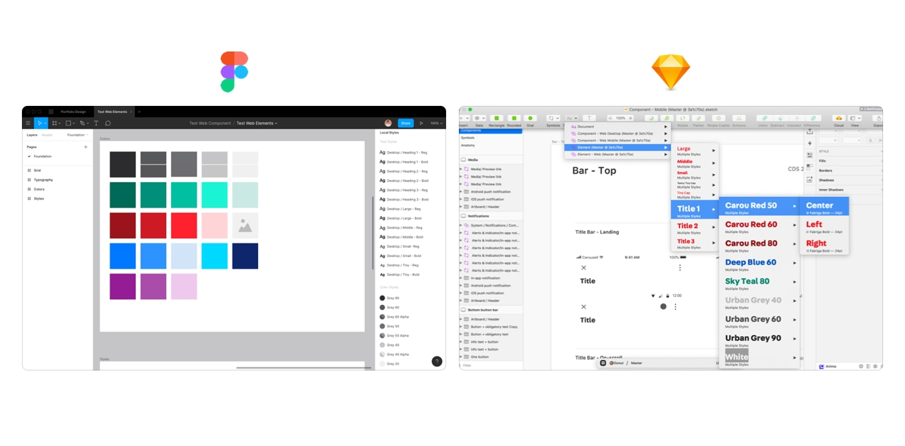
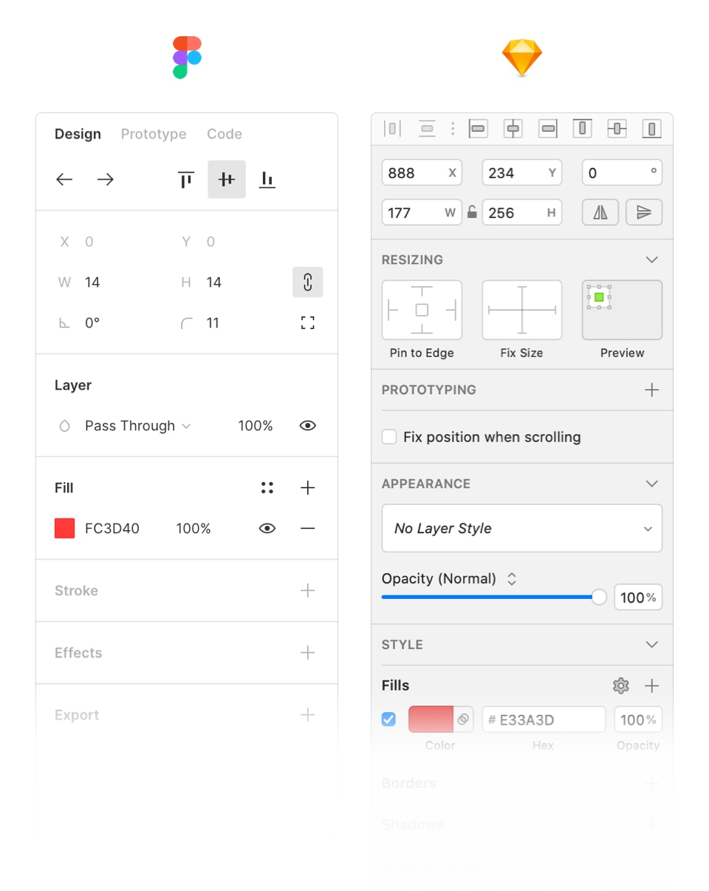

Last month, when I wanted to create a prototype that when we scroll to a certain position, the CTA box will be sticky on the right side. I spent half a day on Sketch to find down how, but just disappointed. Then trying with inVision, but still impossible. I remembered the time my co-worker asked me to join a Figma meetup about how to create a prototype. One idea sparks: “Why not try  Figma to see how good it is?”

Ten minutes later, I made the prototype I need, in Figma. I was very surprised about how smart I am. I tried, and I succeeded. That’s a motivation for me to try more things with Figma.

I want to share my opinions after trying Figma with Sketch's background. Both good and bad.

## Figma is fast, very fast
I’ve been a huge fan of Sketch for 3 years when switching from Photoshop because of the speed, performance, no lagging while designing. Today, Sketch got so much bigger. Along with that, is the decrease in their performance. It’s getting slower. If you work in a team that uses Abstract for version control and sharing libraries, it’s worse.

When trying Figma, my feeling is the same as the moment I tried Sketch while using Photoshop. The speed is so much faster.

With Figma, we still need to wait a bit to open the file because it needs to load the project from the cloud. After that, we can work smoothly without lagging, even with a big design file.

## Smart on handling text style and color for Design System
Figma doesn’t care bout colors or alignment when creating text style. In our Design System at Carousell, we have 7 different font sizes, so with Sketch, we created 7 font sizes x 2 font weights (regular and bold) x 3 text alignments x 10+ colors = 360+ text styles. One new color will add 36 text styles to our library. That makes the choosing text style process very difficult and a lot of time.

With Figma, 14 text styles are the maximum, we can have any color as we want. It’s so much easier to use and maintain. This is the biggest difference between Figma and Sketch. And it totally makes sense.

  
  <figcaption>Text style and color of design library in Figma vs. Sketch</figcaption>

## Creating prototypes is very fast easy
Not only on creating a simple prototype, but Figma also provides rich tools on creating many types of interactions and advanced animations.

Many products want to add many features as possible to their product to make it less dependent on other parts. And the consequence is a complex product, then the performance gets worse, Photoshop and Sketch are some examples.

It was also my first impression for Figma when knowing that that new tool combines design, prototype, collaboration and hand-off in one product. After trying it with their prototype feature, I had to say “Wow, that’s all we need to create a prototype.”

Figma has all behaviors for both web and mobile (all mouse events like hover, enter, click to tap, long press, swipe), from basic to advanced animation and all real devices (iPhones, Android, iPad,…).

I want to nominate the best thing in prototyping with Figma is the way we create modal/pop-up interaction. First, we need a frame with actions that open the modal. Then we create a separated modal component. Then we add an interaction between the button and the component with the “Overlay” attribute then done. We created a full modal interaction that is open with smooth animation, dismisses the modal by clicking outside.

The same method applies for pop-over which you want it to be shown in a specific position. We can do it easily with the same flow.

They learn very well this feature from inVision. Brilliant!

I want to mention about the Smart animation that they’ve just released. We can create awesome animations as [this guy did](https://uxdesign.cc/ios-animations-with-figmas-smart-animate-954c13a30cad):

  
  <figcaption>Face ID animation recreated with Figma’s Smart Animate</figcaption>

Sketch makes me lazy on creating prototype, but Figma encourages me to create more prototypes which designers need to do more to show our ideas, instead of static images and slides. Because a prototype is worth 1000 meetings.

## Web-friendly and collaborate easily

You can think of Figma as Google Docs for design. On Google Docs, people write, comment, collaborate and share text documents. Same on design for Figma. PMs, Engineers can come to the project, draw another button, change the headline copy, add their feedback or just add some notes to make the hand-off clearer.

PMs share with us their Google Docs so we can give our feedback. Why we designers don’t do the same? In the future, design is all about collaboration. The time for the only man designer is over.

And Figma has built on Web, it makes easy to share or embed design in any place like Jira, Influence, Trello,… Web is so powerful.

---

## Then what isn’t good about Figma?

They are good things about Figma after trying it for one month. But it’s still young, it’s not perfect. There are many things they can improve on.

### Lack of box-shadow attribute

It doesn’t have spread attribute for box-shadow, which CSS supports. Spread attribute help me create beautiful box-shadow, or use it as a border because it doesn’t affect the size of components, then we will not face the flicking effect.

For example: with a text box, we have a normal and active state. I want to set the box in the active state to 2px border with a blue color. If we use the border in CSS, there will be lagging/flicking when switching between two states. We can solve it with `spread` attribute on box-shadow.

### Can’t paste image to a component

We can’t copy images from the web and past to a component. I do it very often in Sketch. Moving to Figma, I have to download all the photos to my machine then I can use it. Small but I really need to speed up my workflow.

### Unpolished UI

Figma’s UI was noticeably unpolished, with low contrast and blind controls. It’s not very easy to spot the area to edit background color, border or effect. I have to look very carefully to find them.

  
  <figcaption>Low contrast on Figma's UI</figcaption>

- - - -

In summary, moving to Figma seems like a better choice for big teams with many designers, engineers, and PMs. The cost is also cheaper when comparing with Sketch and its “partners” like Abstract for version control, Zeplin for hand-off and inVision for prototyping.

But test if yourself first. This sounds obvious, but nevertheless: no matter how exciting the new tool may seem in theory, you’ll never know if it’s the right fit for your org until you try it for real. Don’t ever hesitate to throw out your old tools and come up with new ones.
