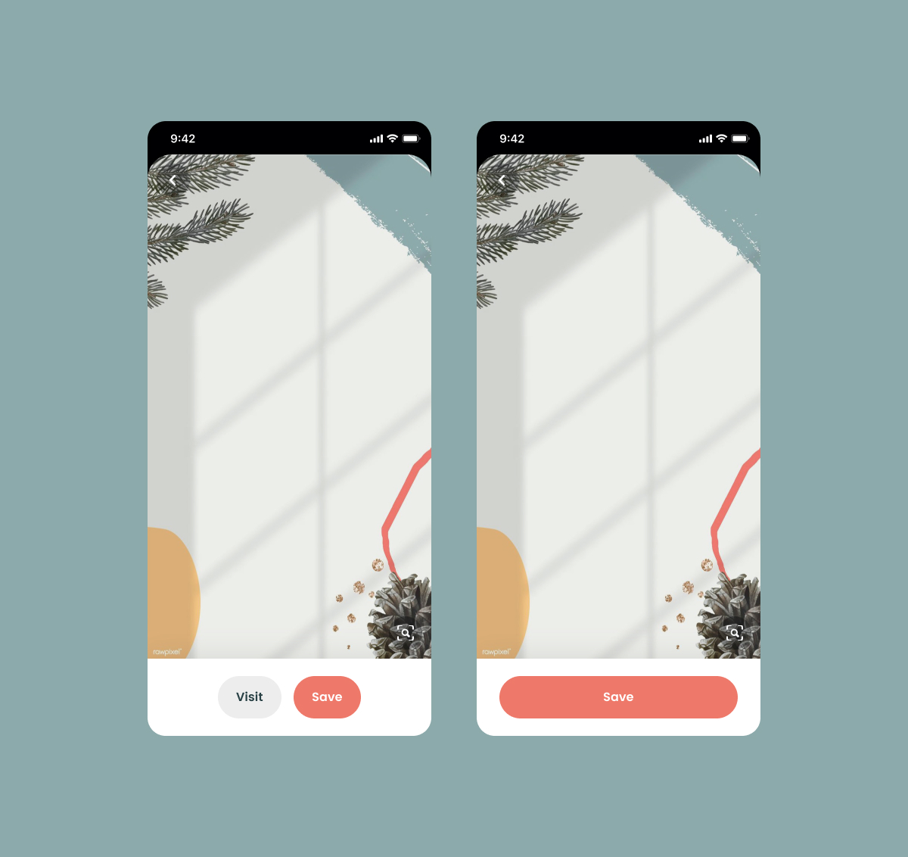
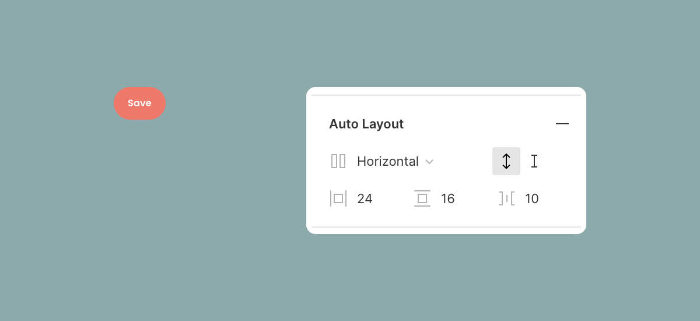
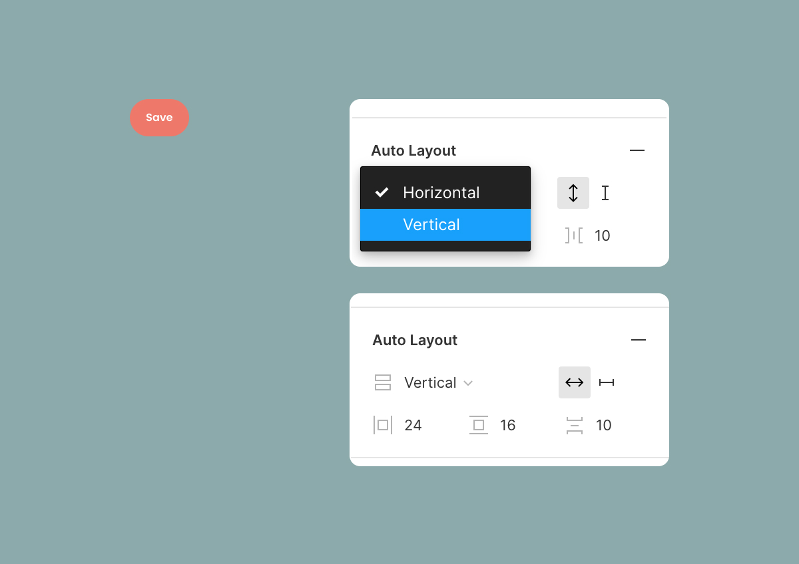
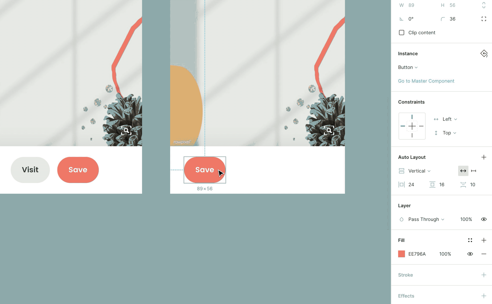
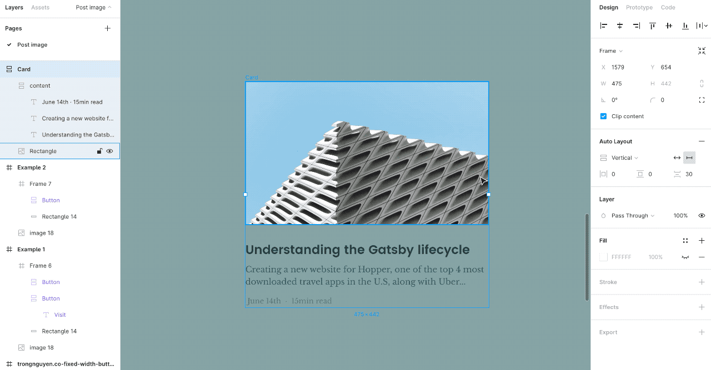

I want to build a button component, how can I make it either auto width depend on the content and resize to the size I want with Auto Layout?

I’m trying to build a Design System (DS) in Figma, start with a button component. I want my DS to stay light as possible, meaning that one component works for many cases.

And with the new feature, Auto Layout - I’m totally converted. Auto Layout is an awesome feature. It works unbelievably!

But soon, I realize that how to resize a constant with their component is built with Auto Layout?

Let see what I want to do for that button component. My team usually use a button in two ways:

1. Button’s width is flexible depending on the content inside
2. A full-width button that fixes with the screen size - which we have to resize the button manually

  
  <figcaption>2 use cases of a button component: auto and fixed width</figcaption>

How to we do it with the same component? We can create two different button components: one is with auto layout, one without it - the traditional way. But by doing this way, our DS library has two different components. Then if we do the same for other components, the DS will get bigger, our library isn’t clean, and it doesn’t spark joy.

## If you have the same problem and want to maintain a clean DS like me, try this simple way:

1/ Create a button with auto layout

  

2/ The most important step: Select “Vertical” instead of “Horizontal” as default. With “Vertical” layout, we have two options for the width: auto and fixed.
- Auto is for auto layout, the width will change based on the content
- Fixed is for resizing the width to any size.
Then the master component, we should leave it as “Auto” so that the constant can use the auto layout as default.

  

3/ When using the constant, change layout option to “Fixed”. So now you can resize to any size you want

  

Done! Now you have only one component for two different cases. I hope it helps you solve the problem.

Ironically, it only works with a simple component like button, text input… For more complex component like a card, it doesn’t work

  

I’m sure that Figma will improve it since this is just the first version of Auto Layout. I can feel how hungry they are. They released new features very fast. Just a couple days before the launching of Auto Layout of Figma, Sketch posted a video about their plan for 2020, many cool features. It sounds very promising. But in design or art industry, there is a basic principle:

> “Show, don’t tell”  

Sketch team should be more hungry as they were at the early stage of building Sketch. They are getting slower and heavier.
