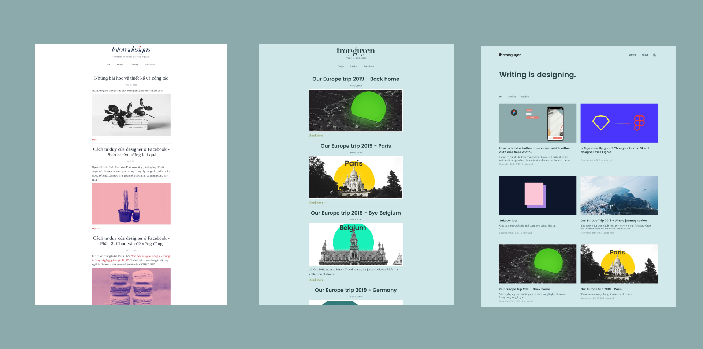
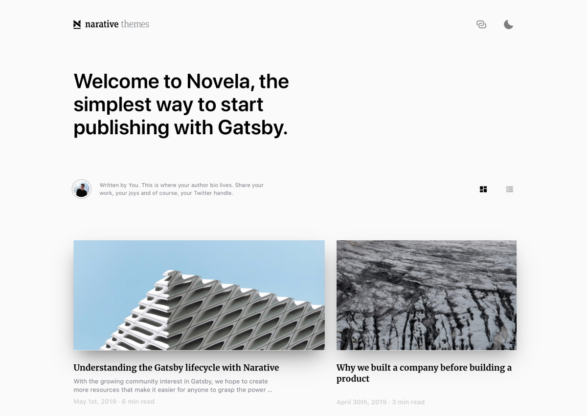

4 months ago, I launched my new blog which I talked about it in this post. Last week, I released a brand new website.

You might think that “Changes” is the most favorite song of designers.  Yes, not wrong, but not too bad. We always want to make something better. And that’s why I built this new website.

Let look at my website revolution:

  
  <figcaption>My website evolution from 2017 - 2018 - 2019</figcaption>

I built my old website on Tumblr which I customized the template to fit my style. It’s a good choice for me because I only know the basic HTML and CSS, I didn’t know how to set up a website. I also didn’t want to pay for the hosting server, it was a tiny personal website.

I was still satisfied with my website till three weeks ago. Engineers in my team were talking about GatsbyJS. They said that my ex-colleague designer built his website with Gatsby. I was very curious and ask them what is that Gatsby. They said that it was a framework to build static sites like blogs or landing pages.

It’s exactly what I’ve looked for quite a long time. I couldn’t stop myself from thinking about it and I jumped into Google to search for GatsbyJS. From that day, I spent two weeks to learn about it.  I updated the template, learned how to add new pages, transferred old posts to the new website.

And now, you’re reading on a website that was built in two weeks. Magical, right?

Things seem very difficult at first impression, but if you want to do something for yourself very badly, you can do it. And let me break down how I built this website.

## Using a Gatsby template
 I even didn’t learn the basics of GatsbyJS. I read some articles about it and knew that there were some Gatsby templates that I can use. And I was very lucky to spot one nice theme: [Novela](https://novela.narative.co).

  

This is the best free theme ever: beautiful in every pixel, careful customized for desktop and mobile, and dark mode. And it came with very detailed documentation that guides us on how to use that theme.

If you’re finding a good theme, it’s worthy to try [Novela](https://github.com/narative/gatsby-theme-novela)

## Customize the theme to match personal taste
This is a must when using a free theme. Changing color, logo, image, site’s info, SEO. And any other thing you can do to make that theme become yours, not a copy of that theme. Because it’s a free one, many people will use it.

In my case, I want my website to be my portfolio to showcase my works and a place I can write. The theme is main for blogging, so I had to customize many things.

I tried to add other pages like [About](https://trongnguyen.co/about) and [404](https://trongnguyen.co/ass), and the most challenging is the [Portfolio](https://trongnguyen.co) that should have all projects I want to show the detail of each project.

My basic knowledge of HTML, CSS, and ReactJS couldn’t help me. I asked my developer friend for help, then I asked my web engineer wife. I also created an issue on Novela’s GitHub to ask the creator for help.

Finally, after many times for try and fail, copy and paste, I succeed on creating the portfolio page. It was the biggest happiness last month. You can’t imagine how happy I was.

## Hosting the website on Netlify
I’m hosting my website on Netlify with a free plan, that is too good for me. They give a limited bandwidth, limited time to build the site. But it works fine for me. I don’t have any visitors, I don’t care about it now. My main purpose is practicing to write.

Netlify is very easy to use and convenient. When we connect it with our repository on Github, it will auto build a new version every time the project gets updated on Github.

feeling is like when you have a new house, you always want to decorate it, keep it clean and make it more beautiful.

So, if you are thinking about how to build a website, try GatsbyJS, use a theme you want, customize it and host it on Netlify. And if you need, drop an email to **tantrongtt@gmail.com**

Thanks for reading.
