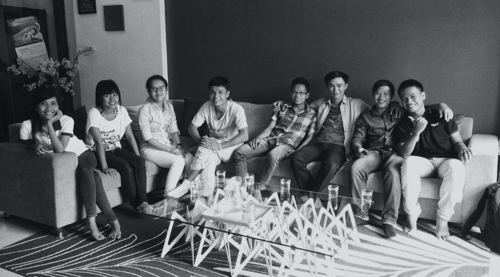

We got married five months ago. Nothing different before and after marriage. People say that our life would be very difficult when we get married. Until now, everything stays the same.
Because we had stayed together for almost half year, before our wedding, and we don’t stay with our parents. That’s why there’s no difference before and after.

On March, next year will match five years from the time my girlfriend nod her head to my three words “I love you”

Five years is a long time, many things happened, challenging, long-distance, career change…

Now I’m going to tell you our story.

Everything started more than five years ago. We met the first time during our internship at Code Engine Studio, a software company. I was a final year student at the University of Technology of Da Nang. She was the 4th year student at the University of Economy.

I took that internship because I wanted to learn User Experience Design. And she wanted to become a software engineer. Seems like both of us chose the wrong universities. But life brought us together in a young start-up where we met our best brother and sister, Christophe and Sakura - the founders.

We were lucky.

  
  <figcaption>She and I, the 3rd and 4th from left to right on the first day of the intership.</figcaption>

3 years later, I decided to go to Ho Chi Minh (HCM) city to work because I wanted to work for a product company where I design products for real users. It was a difficult choice. I thought a lot about that decision. My girlfriend would still stay in Da Nang. She didn’t like HCM and didn’t want to drop the job at Code Engine Studio.

Moving to HCM to work was my goal when I was in university. I thought that if I didn’t go at that time, later it would be much more difficult. And someday, I would regret.

March 2017, the first time of the long-distance relationship. I got an offer with so much higher salary.

I was lucky.

7 months later, Truc, my future wife, wanted to move to HCM to stay with me. It wasn’t difficult for her to get a good offer in that young city. She accepted the offer and would move to HCM in one month.

But then, we applied for other jobs in Singapore. I wasn’t sure what her purposes were when applying for jobs in Singapore. She said to wanted to challenge and looked for luck, anyhow, she had got a job already.

And she got an offer from Singapore, to work for Sephora as a web engineer. Sephora - a giant retailer on beauty products. How could she reject it? No. There was no doubt for her to say Yes.

So her flight from Da Nang didn’t stop at HCM but flown straight to Singapore. Working abroad, for a famous company that sells things she loves, with a much much higher salary.

December 2017 was her first day at Sephora Singapore. I was still in HCM. The distance between HCM - Singapore and Da Nang - HCM wasn’t different. So it was not bad for us. In contrast, it was good for her. 

So she was lucky.

Staying alone in a different country wasn’t easy, it was extremely difficult for her. In a strange place where she had no friend, relative or anyone to talk. Speaking in a different language, a different culture. She was frustrated in the first half-year in Singapore. We weren’t sure where our relationship would go. I had to find a job there.

I started to do some research and updated my CV to apply for jobs in Singapore. If I wasn’t wrong, I had started to send my CV from April 2018. I couldn’t remember how many companies I sent the CV to, but not less than 50.

Some companies never replied to me, some invited me to the phone screening interview, few of them let me to the final round. I was all failed. They said that they weren’t sure about my communication - which was very important for a UX designer. Communication was my biggest weakness, my Achilles heel.

I used to want to give up. Kept working in HCM and light to Singapore every month to see my girlfriend. I had spent too much time on finding a job. Interviewing was very stressful. It had been 6 months for my journey of finding a new job.

I tried applying for the last chance, if I got rejected, I would stay and focus on my work in HCM. Luckily, I got an offer from Carousell after 6 rounds of interview. I couldn’t sleep on the day they called me via Google Hangout about the offer, my girlfriend either. Then I understood that if we follow our goal long enough, we would touch it. It’s persistent.

Dec 10th, 2018, I started my first day at Carousell Singapore. Working abroad, with many good Designers, good Product Managers, and a good salary. Above all, we stayed together.

We were lucky.

Things go around come around. We were reunited. Two is better than one.

And finally, in July 2019, we got married. I wasn’t sure that I had been ready for the relationship yet, she neither. We all still felt that we were too young to get married. But it was good for us, good for our parents.

We are ready when we’re ready. It’s never too early, either too late. Many things are waiting for us. We will enjoy it.

  

