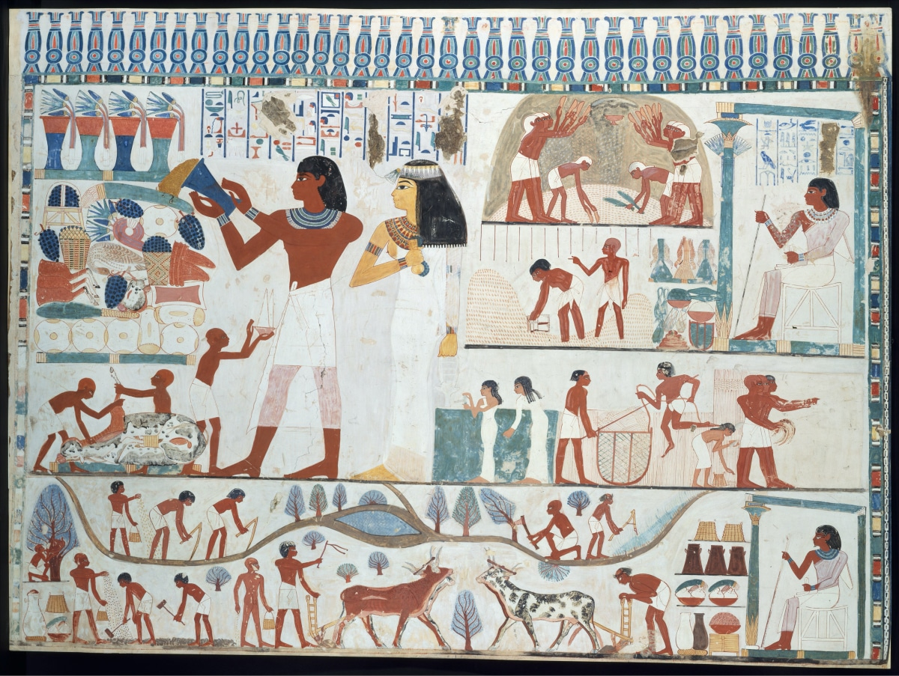
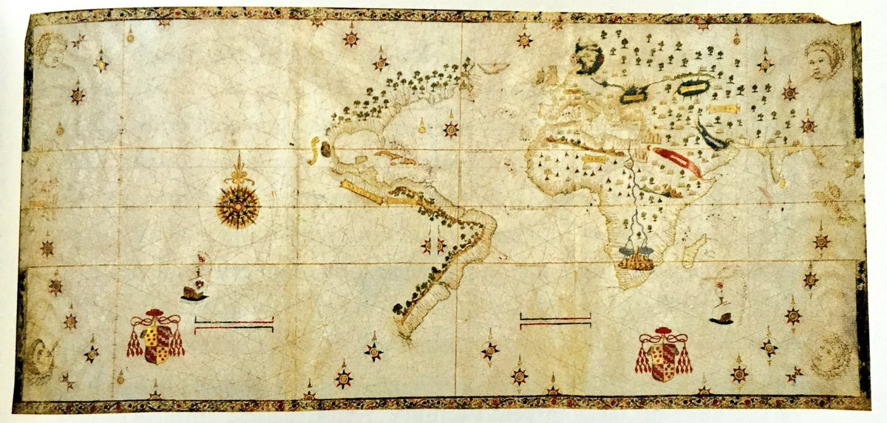

Three years ago, I went to a pub with my best friend to meet his friends. That was the time I had just come to Ho Chi Minh City (HCM). I didn’t have many friends there. So I followed my friend to meet new people.

There was one guy talked about a book he had read, called Sapien. He shared very wise things that I had never heard before. Then with his knowledge from the book, de debated with other guys. Of course, he was the most convincing at that time.

I wondered to read that book to be wiser, like him.

Three years later, I read the first page of the book. It took too long to start, but finally, I did it can couldn’t stop.

Honestly, the first chapters aren’t interesting at all. I used to want to give up. But the more I read, the more tempted it is. And I had finished the 500+ pages in two weeks.

“Sapien - A brief history of humankind” covers human history from the time we were a “monkey” to the first revolution of human - the Agricultural  Revolution - to the industrial revolution to today’s life, and also predictions for the future.

There is much knowledge from this book. But I will just talk about two things that are the most memorable.

I encourage you to read the whole book to know how good it is. When you read it, some points are very subjective. Because he doesn’t have evidence to prove it. But they are from a different point of view that we’ve never thought about. Some are very surprised and interested. Here are two of them.

## The Agriculture Revolution was history’s biggest fraud

  
  <figcaption>A wall painting from an Egyptian grave, dated to about 3,500 years ago, depicting typical agricultural scenes.</figcaption>

The transition to agriculture began around 9500 - 8500 BECAUSE. Today, with all our advanced technologies, more than 90% of the calories that feed humanity come from the handful of plants our ancestors domesticated: potato, rice, wheat, millet, and barley.

Scholars once proclaimed that the agriculture revolution was the great leap forward for humanity.

The agriculture revolution certainly enlarged the sum of the total of food, but the extra food did translate into a better diet or more leisure. Rather, it translated into population explosions.

The average farmer worked harder than the average forager and got worse diet in return. The agriculture revolution was history’s biggest fraud.

Those plants domesticated us, rather than vice versa.

Think about the agricultural revolution from the viewpoint of wheat. Ten thousand years ago, wheat was just a wild grass in the Middle East. Suddenly, it was growing all over the world. It covers 2.25 million square kilometers of the globe surface, almost ten times the sizes of Britain.

Wheat did it by manipulating humans to its advantage. Wheat didn’t like rock and pebbles, so humans broke their back clearing fields. Wheat go sick, so Sapiens had to keep a watch out for worms and blight. Wheat was thirsty, humans lugged water from springs to water it.

Studies of ancient skeletons indicate that the transition to agriculture brought about a plethora of ailments such as slipped disc and arthritis.

We didn’t domesticate wheat. It domesticated us.

## Why Europe became the master of “Outer World”?
In 1775, Asia accounted for 80% of the world economy. The combined economies of India and China represented two-thirds of global production. In comparison, Europe was an economic dwarf.

By 1900, Europeans firmly controlled the world economy. Western Europe and the United States together accounted for more than. half of the global production, whereas China's portion has been reduced to 5%.

Today, all humans are European in dress, thought and taste.

They may be fiercely anti-European, but almost everyone views politics, medicine, war and economic through Europeans eyes, listens to music written in European modes.

How?

In 1770, Europeans had no significant technological advantage over  Muslins, Indians, and Chinese, how did they manage in the following century to open such a gap between themselves and the rest of the world?

The key factor was that Europeans admitted ignorance, they said: “I don’t know what’s out there”. They felt compelled to go out and make new discoveries.

Previous seekers of empire landed to assume that they already understood the world. The Arabs did not conquer Egypt, Spain, and India to discover something they didn’t know. The Romans, Mongols, and Aztec conquered new lands in search of power and wealth, not of knowledge.

In contrast, Europeans imperialists set out to distant shores in the hope of obtaining new knowledge long with new territories.

During the 15th/16th, Europeans began to draw world maps with lots of empty spaces. The empty maps were a psychological and ideological breakthrough a clear admission that they were ignorant of large parts of the world.

  
  <figcaption>Salviati World Map 1525 is most empty. Anyone looking at the map and possessing even minimal curiosity is tempted to ask “What’s beyond this point?”. The map gives no answers. It invites the observer to set sail and find out.</figcaption>

That was how Europe became the master of “Outer World”

- - - -

After reading the book, two things remain on my memory. It teaches me a couple of lessons.

## 1. Look at the world from other perspectives.
It will open a new world.

And we will see new things that nobody knew. Like looking at the Agriculture Revolution from the wheat perspective, Agriculture Revolution is different from what we knew - a human’s perspective.

Things can be good from bad, ugly from beautiful. New ideas, new knowledge will come.

## 2. Having an open mind.
Europeans conquered and master the world because they admit ignorance. In another word, they admit that they don’t know and they want to go out and discover, obtain new knowledge.

Same in design and creativity. There are many product features are born every day, from other people, not you, not me.

Why? Because we think all ideas were invented. We assume that we already understood the world, and the glass is full.

We assume that this is a good design and users should use it easy, without testing it.

Admitting ignorance, like European Imperialism did.