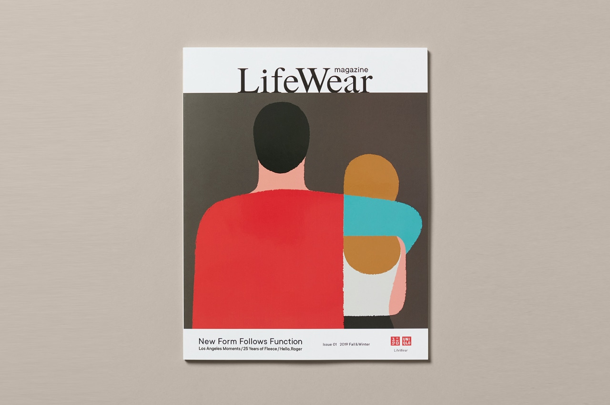
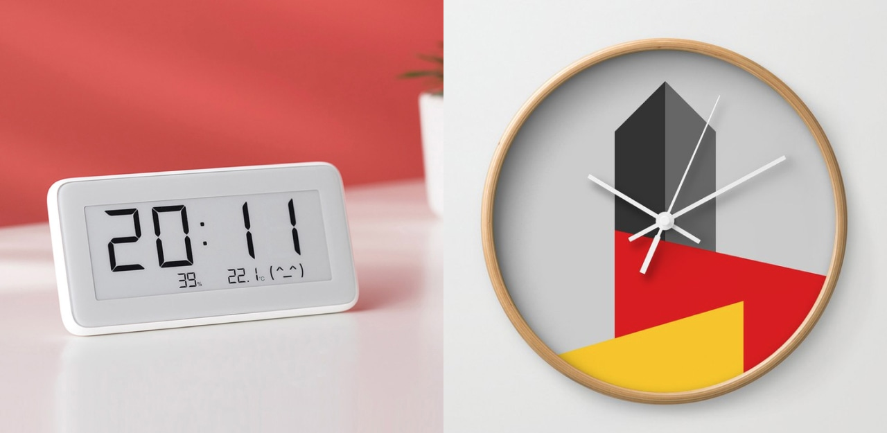
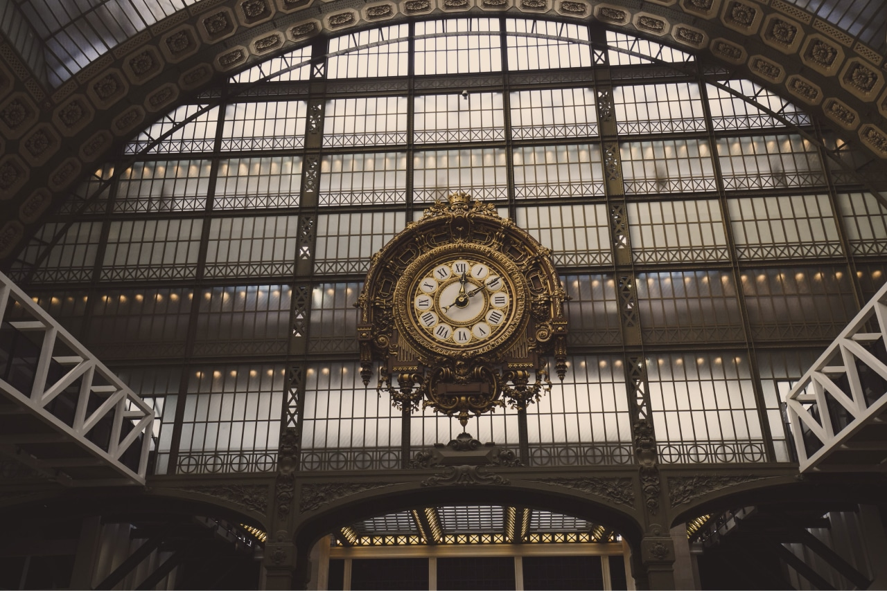

Last year, I got the first Fashion Magazine. LifeWear Magazine from Uniqlo. I got it as a free item. It’s a kind of catalog, but with a nice design.

There was an impressed section. It was called “Form follows function”. I knew about that principle before. But applying for fashion. It was just wrong.

I went through new designs that were designed by that principle. I loved it. Designs were minimal, like the way Japanese life. Minimal but fits the purpose.

But there was one feeling I had missed. The “Wow!”. I love the new designs and the concept. It was realistic. But for fashion, I expected more than that. A high standard aesthetic.

  

The same feeling you will get when you are in the tech industry. Where the principle “Form follows function” is even clearer.

"Form follows function", it means an object should be designed according to its purpose.

We create new products, new features to solve problems. We, designers, design to solve problems. In a fast-moving world, we want to deliver as fast as possible. Some teams create good products with beautiful design. But most of the tech startup, beauty comes later. Where function is the first priority. And “Let make it work”.

We got so carried away with the idea of functionality, we lost sight of who we were designing for in the first place: humans.

Humans connect to the world through emotion. And design without beauty is void of emotion.

## How to design a clock?
If we were to follow “form follows function” as a hard and fast rule, what would a clock look like? Its function is to tell time and nothing else. A designer might conclude that the simplest, fastest and most accurate way to show time would be on a digital display. Digital clocks are not particularly beautiful, though.

Analog displays are more aesthetically pleasing to most people. They aren’t quite as accurate, and people usually need an extra moment or two to tell the time, but they are generally nicer to look at.

Which clock above is best?

  

Rather than use “form follows function” as an inflexible rule, a better route would be to design our clock based on success criteria. If speed and accuracy are most important to the clock’s success, then a digital display would be best. If aesthetics are more important, then an analog display would be the better choice.

Ultimately, you have to determine the goals of your clock and how you will measure the success of those goals. What you come up with will lead you to your success criteria and design objectives. You could decide on an accurate digital clock for mass consumption or a work of art hanging in the terminal of a major railroad station.

  

## Beautiful Things Function Better
People spend more time with products that they find beautiful, and they claim they are easier to use. The products seem to function better because they are beautiful. As in nature, function can follow form.

Steven P. Anderson speaks of the importance of aesthetics in design in his post on A List Apart. He notes:

“Researchers in Japan set up two ATMs, ‘identical in function, the number of buttons, and how they worked.’ The only difference was that one machine’s buttons and screens were arranged more attractively than the other. In both Japan and Israel (where this study was repeated) researchers observed that subjects encountered fewer difficulties with the more attractive machine. The attractive machine actually worked better.”  

Perhaps this can be explained by the “halo effect”. A beautiful product triggers positive emotions that inform your judgment of its usability. The product does not necessarily function better, but you perceive it as functioning better because of its looks.

That’s the function of beauty.
