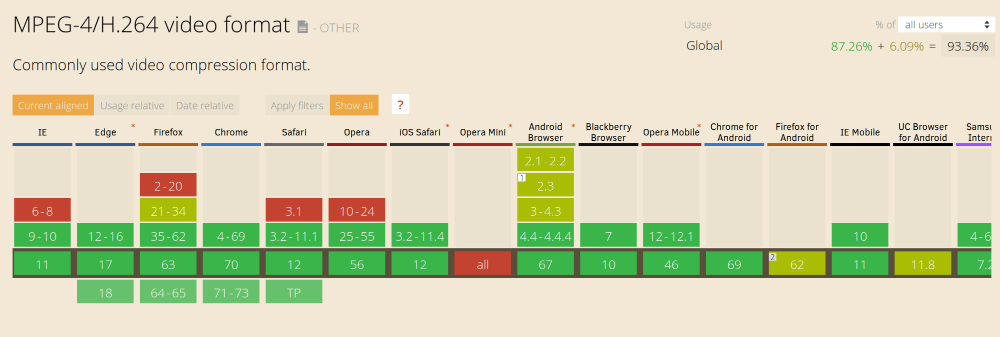
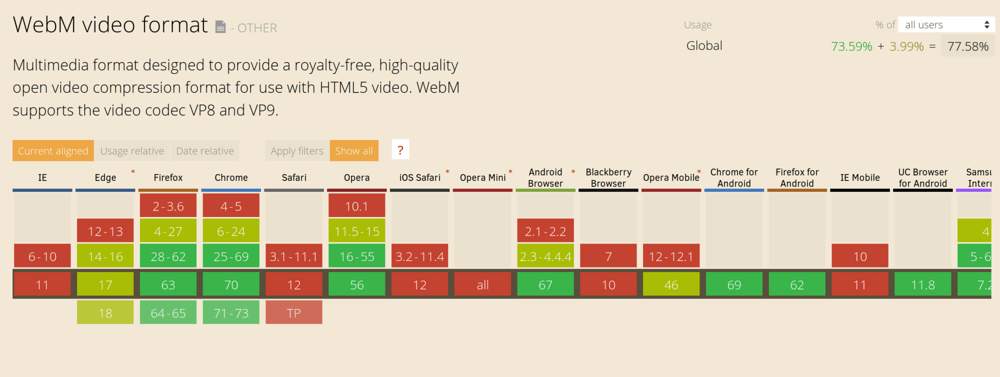
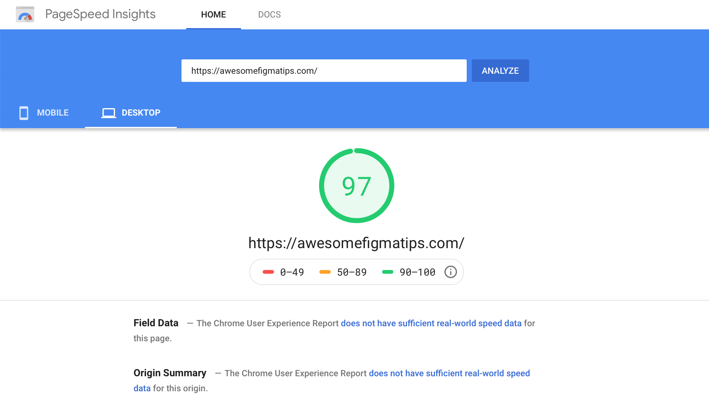

GIFs are one of the oldest graphic file formats on the Web. But the GIF format was not originally intended for animation like we see today.

The GIF file type was created in 1987 to compress multiple images inside a single file using a lossless compression algorithm (called LZW compression) which meant they could be downloaded in a reasonably short space of time, even on slow connections.

Thanks to its ability to include animation, it’s seen a resurgence in popularity.

Today, you see GIF everywhere on the internet.

But for digital products, web and app, is GIF the best choice? Let look at three things to compare with another alternative, HTML5 video.

## 1. Quality
GIFs support transparency as well as animation but include only up to 256 colors within a frame. If a GIF includes an animation, each frame can support a separate palette of up to 256 colors. It can noticeably affect their quality and make them appear pixelated.

But with video, it supports almost unlimited color palettes. Along with color, GIF doesn’t support sound, but video.

Let me show you the difference between a GIFs file and a video file. Those are the same 5 second files

<div class="Grid Col2 Medium">
  <div>
    
    <figcaption>Animation by Markus Magnusson</figcaption>
  </div>
  <div>
    <video autoplay loop muted playsinline src="./images/motion_icon.mp4"></video>
  </div>
</div>

I’m sure you can see the difference between a GIF file and a video file. Believe me, the one on the right is a video. I will tell you how to use it at the end of this post.

## 2. Performance or file size
As you know, the bigger file size is, the longer time to load that file and render it on our website. The longer the time, the worse performance.

Let's look back at the example above. The difference in file size is unbelievable.

The GIF is 215 KB in size. But the Video is only 155 KB in size. The reduction is 60%. Well…

## Browser support
While GIFs are universally supported by browsers. The MP4 video file is the most widely supported format in browsers with almost 94% of all browsers enjoying support, so that’s a safe default.

<div class="Image__Small">
  
</div>

Another option is the WebM format which offers high-quality videos, often comparable to an MP4, but usually at reduced file size. However, at this time, browser support is not as widespread so you can’t just go replacing MP4 files with their WebM equivalents.

<div class="Image__Small">
  
</div>

- - - -

From the above comparisons, if your audience is not universal like Facebook, Pinterest, Twitter,… we can simply use video for better quality and performance.

It’s no wonder services like Giphy doesn’t even use the GIF file format themselves. Instead, they use HTML5 videos that are often as much as 90% smaller in size. Not only Giphy, [Pinterest](https://medium.com/pinterest-engineering/improving-gif-performance-on-pinterest-8dad74bf92f1), [Twitter](https://mashable.com/2014/06/20/twitter-gifs-mp4/#Mtz26DX1BZqG) also converted animated GIFs to Videos to improve their performance.

## Replace animated GIFs with Video in the browser
To make a video act like a GIF on a webpage, we can cause a video file to act the same way using a handful of attributes. Here’s how you’ll embed a video file to behave like a GIF:

```

<video autoplay loop muted playsinline src=“video.mp4”></video>

```

<div class="video">
  <video autoplay loop muted playsinline src="https://cdn.dribbble.com/users/121337/screenshots/10066646/media/d4842c15aa7301b26f7223f87ff57f55.mp4"></video>
  <figcaption>Animation by Charles Patterson</figcaption>
</div>


This markup instructs the browser to automatically start the video, loop it continuously, play no sound, and play inline without displaying any video controls. This gives the same experience as an animated GIF but with better performance.

That’s the mockup I used for my new side project [Awesome Figma Tips](https://awesomefigmatips.com)    where I need to show GIF-like experiences when people land on the homepage. With a heavy video website, 97 score from Google PageSpeed Insights is more than I expected.

<div class="Image__Small">
  
</div>

## Wrap up
By replacing animated GIFs with HTML5 video, we can provide awesome GIF-like experiences without the performance and quality drawbacks associated with GIF files. And it leads to a massive improvement in page load times.

#Save the web.
