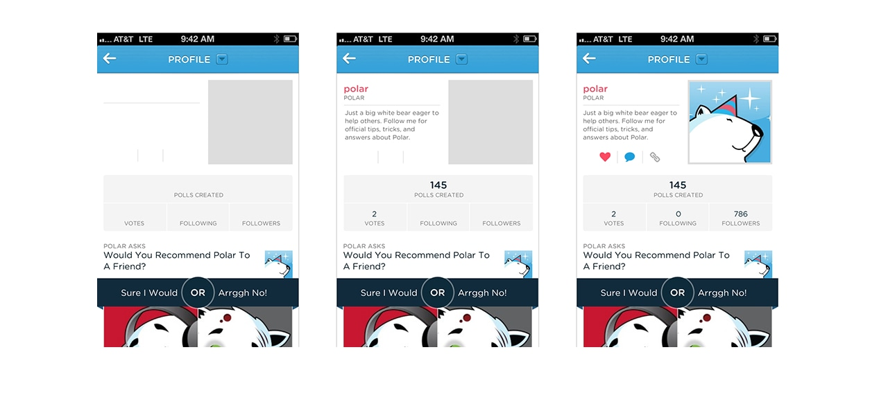
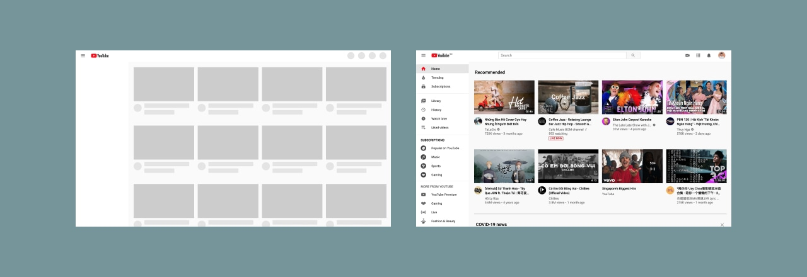

In [the previous post](https://trongnguyen.co/designer-s-guide-for-designing-for-performance-part-1), we went through some technical tips to make the site performs faster. Those techniques are to make the site lighter, so it will load faster. Along with them, we can improve the performance from the understanding of how humans perceive the performance.

Decades ago, [in an attempt to quell customer complaints about lengthy waits](http://www.nytimes.com/2012/08/19/opinion/sunday/why-waiting-in-line-is-torture.html)  at the baggage claim, the Houston airport increased the number of employees working handling shifts to improve the measurable performance of their baggage off-loading. Wait times fell considerably — but the complaints persisted.

The airport executives had failed to see the true problem at hand — a human propensity for loathing unoccupied time. While wait times were down, the walking journey from the terminal gate to the luggage claim was a short trot, so travelers spent most of their time waiting. 

So the airport decided on a new approach: instead of reducing wait times, the moved the arrival gates farther away from the baggage carousel. Passengers now had to walk six times longer to get their bags. Complaints dropped to near zero.

You can find that example is similar to a story of how people stopped complaining about wait times for elevators in New York City’s skyscrapers. Occupants said the waiting times for elevators at peak hours, were excessively long. The management decided to install mirrors next to elevators. Almost overnight, the complaints ceased.

The rationale behind the mirrors was similar to the one used at the Houston airport: give people something to occupy their time, and the wait will feel shorter. With the mirrors, people could check their hair or slyly ogle other passengers.

Those stories hint at a general principle: the experience of waiting, whether for luggage or elevators, is defined only partly by the objective length of the wait. Often how people feel is more important than the statistics of the performance itself.

How we can change user perceptions?

As the Houston airport found out, satisfying users is more than about adding resources - it’s also about understanding what makes people tick.

To leverage customer perceptions about performance, we can use a popular pattern: Skeleton screen.

## Instant load transitions: Skeleton screen

[Luke](https://www.lukew.com/about/)  first coined the term “skeleton screen”  [in a blog post](https://www.lukew.com/ff/entry.asp?1797)  advising that designers avoid using spinners in favor of visual placeholders.

Ask Luke described:

“We learned this lesson the hard way on Polar when we experimented with using Web Views to load parts of our native application’s interface.

To let people know these elements were downloading, we added a spinner that showed up as each Web View was retrieved from our server. Since we used several Web Views, people could encounter these spinners in a few parts of the app and when they did we started to get feedback like this:

“There seems to be an excessive amount of waiting around for pages to refresh and load -it doesn’t seem as quick as the previous version.”

> “With the introduction of these progress indicators, we had made people watch the clock… as a result, time went slower and so did our app. We focused on the indicator and not the progress.”
> <cite>– Luke</cite>

With a spinner, it draws attention to the fact that the user is waiting.

Skeleton screen, on the other hand, the focus is on content being loaded not the fact that it is loading.

  
  <figcaption>Image by Luke</figcaption>

A skeleton screen appears instantly when people first come to your website, or go to a different page and then it is quickly replaced with the site’s content.

So design a skeleton screen that’s nearly identical to the content of your page. If we include elements that look different when the website finishes launching, people can experience an unpleasant flash between the skeleton screen and the content. Combined with a fast launch time, this design approach makes your website feel immediately responsive. 

  

We can even take it further by using dominant colors while waiting for data like Pinterest and Google image search to decrease perceived duration time. The closer look of the content, the better.

Other than that, from [Bill Chung’s research](https://uxdesign.cc/what-you-should-know-about-skeleton-screens-a820c45a571a), using motion to can further decrease perceived duration time:

- A wave or shimmer animation, like Facebook or Youtube, are perceived as shorter in duration than skeletons that pulse (opacity fading in and out). 
- Motion that is slow and steady are perceived as shorter in duration than skeleton screens that use fast or rapid motion

In combination with a fast launch time (by optimizing images, CSS, fonts...), a skeleton screen makes your website feel immediately responsive.

We’ll never eliminate waiting times, but a better understanding of the psychology of waiting can make those inevitable delays more bearable.

And psychology plays a huge part in product design. In the future, I will look at more psychology principles in design to help us design a better product.

Thanks for reading.
