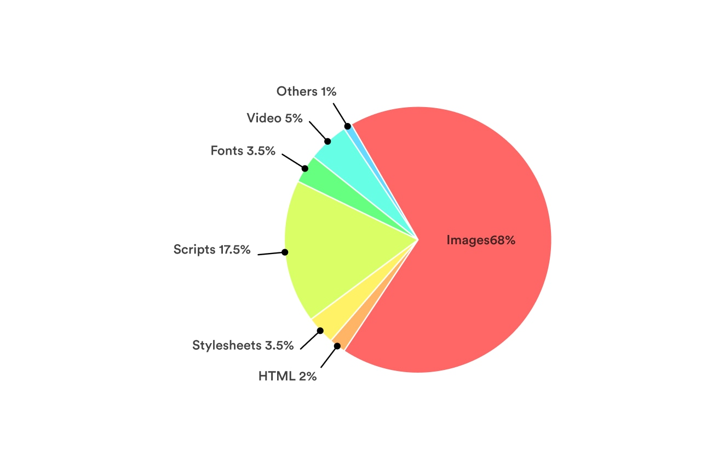
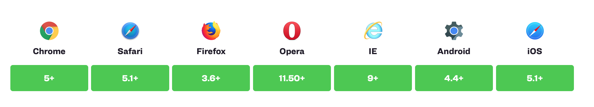

When we talk about performance, we often blame it on engineers. That’s their job to make the site faster.

Performance is a part of the whole user experience. A faster site will enhance the experience of users. But when they have to wait for half of a minute to see the page, they will leave.

If we, designers, want to design a good user experience, we have to care about the performance. We have many things to think about when it comes to design.

When we talk about performance, we’re talking about how fast the site load. We’ll aim to optimize for:

- Time to load a page. This includes technical stuff like the number of resources (images, fonts, CSS, HTML), and file size of these resources.
- User’s perception of how fast the site. We’ll aim to improve the performance from our understanding of how humans perceive the performance by emotions and psychology.


## Why performance is important?
DoubleClick by Google found 53% of mobile site visits were abandoned if a page took longer than 3 seconds to load.

On another research, Akamai has reported that 75% of online shoppers who experience an issue such as a site freezing, crashing, taking too long to load, or having a convoluted checkout process  [will not buy from that site](http://bit.ly/1ttKKNf).

Another important impact of the performance is the impact on mobile users.

When we look at data from  [StatCounter Global Stats](http://gs.statcounter.com/), we can see that mobile is steadily increasing as the total percentage of Internet traffic. At Carousell, 50% of user traffic is from mobile devices.

With the 4G connection nowadays, the connection speed is much faster than 3G. But the mobile connection is usually unstable. The webpage will take a longer time to load.

Performance is a shared responsibility and everyone on your team impacts it. Considering performance when making design decisions will have an enormous impact on your users.

Now, let’s see how we can design to have a better performing website.

## 1. Optimizing images.

Images make up the majority of most sites’ total page weight. Thanks to their relatively large file size and the number of images included on the average site, optimizing images are arguably the easiest big win when it comes to improving your site’s page load time.

<div class="Image__Small">
  
</div>

So what is the right image format for the web?

### JPEG - the ideal image format for web

In general, JPEGs are the ideal firm format for images on the web. JPEGs are good for photographs and images with a large spectrum of colors. JPEGs are lossy file formats. They are designed to compress files in ways that our eyes won’t notice at a high enough quality.

When we use the function “Save for Web” in Photoshop or using tools likes ImgOptimze to optimize JPEGs, we can improve further the performance and the file size.

With those tools, we can generate progressive JPEGs that load faster than the baseline JPEGs. Because progressive JPEGs fill in space with a low-quality version first, then load the high-quality version after. It affects the perceived performance of how fast your site loads. Meaning that your site seems to load faster with progress JPEGs.

But JPEGs don’t support transparency. What should we do? We can easily use PNGs. But PNG has a larger size than JPEG. It’s not good for performance.

If possible, try to use JPEGs instead. We can play with the background color a bit. If we use that image on a solid background, export the image in the same background color. That trick will work some time.

### How about GIF?

GIFs are one of the oldest graphic file formats on the Web. But the GIF format was not originally intended for animation like we see today. But thanks to its ability to include animation, it’s seen a resurgence in popularity. Today, you see GIF everywhere on the internet.

For digital products, web, and app, GIF isn’t the best choice. Especially when we talk about the quality and the file sizes. I wrote a very detailed article to talk about it [here](https://trongnguyen.co/gif-vs-video). Check it out if you want to know more

Even services like Giphy doesn’t even use the GIF file format themselves. Instead, they use HTML5 videos that are often as much as 90% smaller in size. Not only Giphy,  [Pinterest](https://medium.com/pinterest-engineering/improving-gif-performance-on-pinterest-8dad74bf92f1),  [Twitter](https://mashable.com/2014/06/20/twitter-gifs-mp4/#Mtz26DX1BZqG)  also converted animated GIFs to Videos to improve their performance.

So if possible, try to Replace animated GIFs with Video in the browser.

To make a video act as a GIF on a webpage, we can cause a video file to act the same way using a handful of attributes.

```
<video autoplay loop muted playsinline src=“video.mp4”></video>
```
<div class="video">
  <video autoplay loop muted playsinline src="https://cdn.dribbble.com/users/829956/screenshots/9512608/media/017f9e6a093d6f02118762803228a942.mp4"></video>
  <figcaption>Animation by Ana Sakač</figcaption>
</div>


### Using SVG

SVGs are becoming more popular nowaday. Thanks to the file size and the ability to resize without pixelating images in any screen types. And with SVGs, we have more controls.

If your icons or images in a single color, gradient or little detail, SGVS are a great replacement.

The major advance of using SVGs is that it displays beautifully in both retina and no-retina screen. Rather than creating high-resolution duplicates of your images to serve up to high-resolution display. Because SVGs are vectors and they scale smartly. Also, by replacing images files with SVGs, you eliminating an HTTP request to go and fetch the file from the server.

Another benefit of using SVGs is the ability to change to any color. We will provide one SVG icon file, then when using it, we can change to any color we want. For example, we can change to different colors for a normal and hover state for an icon in a button, with the same SVG file. If we use images like PNGs or JPEGs, we have to create two different images. One for the normal state, one for the hover.  With SVGs, we can change it easily in CSS.

To optimize even further SVGs, try to use a tool like [SVG Comporess](https://jakearchibald.github.io/svgomg/). It can save 50% of file size.

The only disadvantage of using SVGs is browser support. IE8 and older don’t support SVGs. But IE8 is dead, replaced by a better browser Microsoft Edge. So check your date, if the number of IE8 users is small, go ahead with SVG.

## 2. On using fonts

The font you choose to use on your website will affect the loading time. Unless you use system fonts (fonts changes depend on the OS).

The good thing with system fonts is they are available on all devices. So the site doesn’t need to load fonts. Clearly, your site will load faster.

The bad things are … your site isn’t consistent across all devices and your site is almost similar to other websites. The typography is the same. Designers don’t like that way. Another thing is not all the system fonts are beautiful. Most of them are optimized for reading and working well in the OS but aren’t prioritized for the aesthetic.

So if we don’t want to use system font, there are two ways to use custom fonts: using an online web-font service and self-host web-font.

Online web-font services like Google font, Fontspring,… They have many choices and optimize for speed or loading time. But not all the fonts you love are available and free. Then you will consider to self-host your fonts.

With the self-host, we have to add file files to our source code. For example, if you want to use the font Circular in normal and bold styles, you have to add two different files: one is for normal, one for bold. We need those files in .WOFF (Web Open Font Format) to make sure the font is well rendered in different devices and browsers. If possible, we should include also the .WOFF2 files, a newer web-font format developed by Google, optimized for speed.

If we want to support more browsers like IE8 and older, we need more other file formats like .TFF, .OTF.

But keep in mind that the more file you include, the heavier your site, the longer time to load.

In a nutshell, if we’re only aiming to support modern browsers, include only .WOFF and .WOFF2. The CSS will be like this:

```
@font-face {
  font-family: FontName;
  src: url(‘path/filename.woff2’) format(‘woff2’), 
    url(‘path/filename.woff’) format(‘woff’);
    font-display: swap;
}
```

<div class="Image__Small">
  
  <figcaption>Browsers support.</figcaption>
</div>

Once the font has been declared and defined, we can put it to use on our elements. For example:

```
body {
  font-family: ‘FontName’, Arial, sans-serif;
}
```


Why do we need two web-font file format? Depend on the browsers, the most suitable font files will be loaded first. Meaning that when users use Chrome, the .WOFF2 will be rendered, but for Safari, the .WOFF will be rendered (.WOFF2 developed by Google, .WOFF developed by Apple). That way will make our site load faster.

The property `font-display: swap;` is to tell the browser that let use the fallback font while waiting for the custom font loads (in this case, it’s Arial). So we make sure that the text will be always available right after users load the site. After the custom font is loaded, the font will be swapped to the custom. It makes users feel the site load faster.

Using online web-font services or self-host are both fine. It depends on your usage to decide which one is better for performance. Sometimes, online web-font takes a longer time to load. Sometimes it’s faster. Check [this article](https://www.tunetheweb.com/blog/should-you-self-host-google-fonts/) for more detail on when to use web-font, when to self-host your font.

## 3. Mobile-first approach

You heard about it before. The term “Mobile first” has distinct meanings depending on the context.

When we talk about performance, a mobile-first approach forces you to consider our smallest screen sizes first. An approach in which you make hard decisions about functionality and content hierarchy at small screen sizes will help you keep your total page weight and the number of requests down.

For our responsive site, consider your smallest screen sizes first. Reorder your CSS to deliver small-screen styles first, and use progressive enhancement to add content and capabilities as screen sizes get larger.

Deliver correctly sized assets, and make the page’s core functionality interactive as quickly as possible.

From there, you can make decisions about how to share larger assets on larger screens, reflow content in your hierarchy, and continue to be deliberate about performance in your overall user experience.

- - - -

By choosing the right image format, choosing the right way to host your font and approach the design and code with mobile-first, we finished the hardest part of designing for performance. But what else we can do?

In the next post, we will talk about human perception and how we can apply it to design to make the site perform better.
