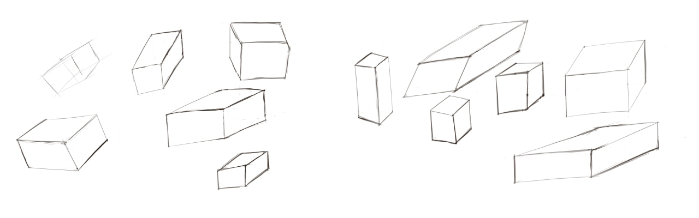
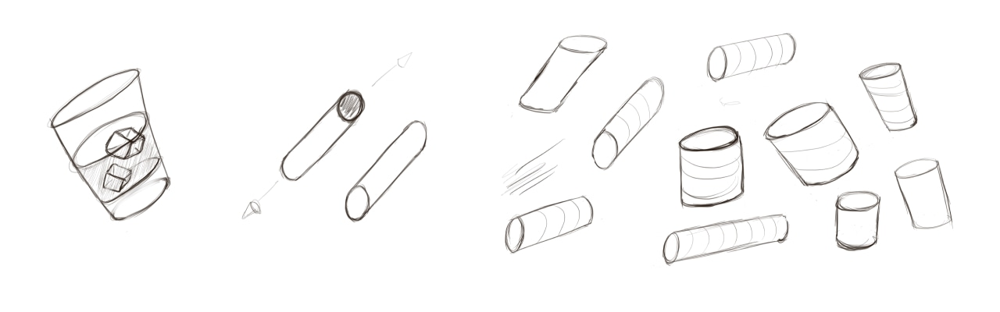
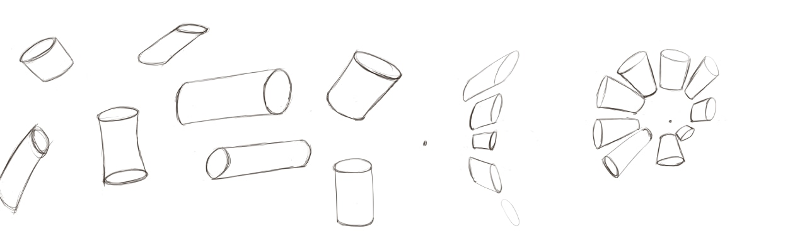
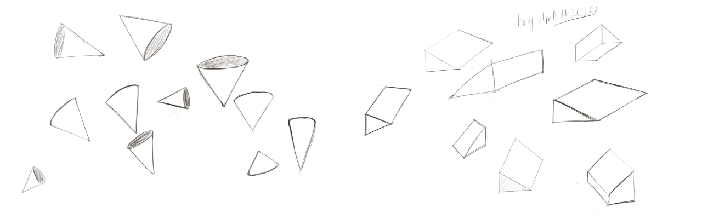
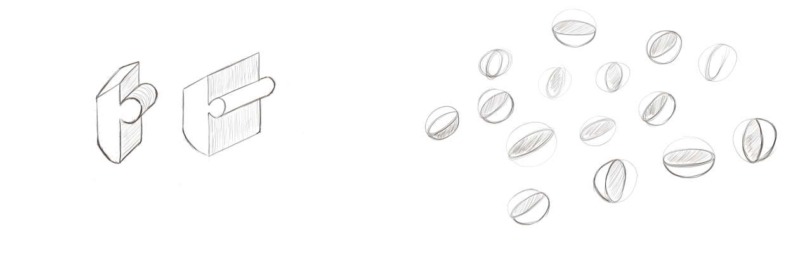
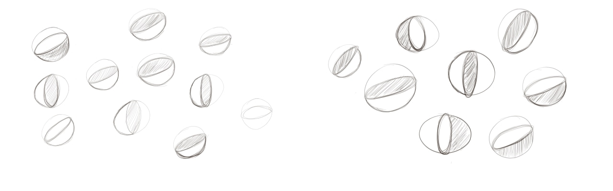

First, enjoy my enjoy my stupid animations while learning to draw (Anyway, animation was the reason why I decided to learn drawing :D ).

  <video autoplay loop muted playsinline src="https://video.twimg.com/ext_tw_video/1249325394978729984/pu/vid/1280x720/6RUNrBPmEajltZjO.mp4"></video>

Aother one:

  <video autoplay loop muted playsinline src="https://video.twimg.com/ext_tw_video/1249325496698990592/pu/vid/1280x720/n6WzXnlHwDvWp-6n.mp4"></video>

---

I started to learn lines, curves, then 2D shapes and soft organic 2D shapes.

This week, I learned a new lesson: form. I learned how to turn 2D to 3D form, then learn why should we draw through objects to turn 2D form to 3D form easier. We can erase redundant lines at any time. But when drawing through, it encourages me to draw and ignore perfection and start to practice. Practicing is the only way to make us feel better.

It makes me remember one favorite quote that I mention on [this post](https://trongnguyen.co/can-t-get-good-ideas-come-up-with-some-bad-ones) from the book “Tool of Titans” by Tim Ferriss

> “Can’t get good ideas? Come up with some bad ones”  
> <cite>– James</cite>

It’s your brain trying to protect you from harm. The way you shut off is by forcing the brain to come up with bad ideas.

The same principle applies here. If you draw enough bad shapes, a few good ones tend to show up. So the goal isn’t to draw beautiful shapes, the goal is to draw bad ideas. Because once you get enough bad sketches, some good ones have to show up.

Here are all my bad sketches this week.

  

  

  

  

  

  

