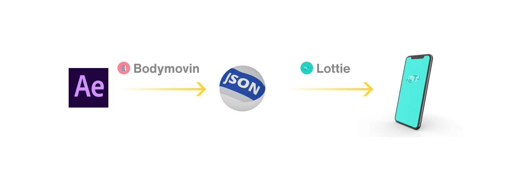
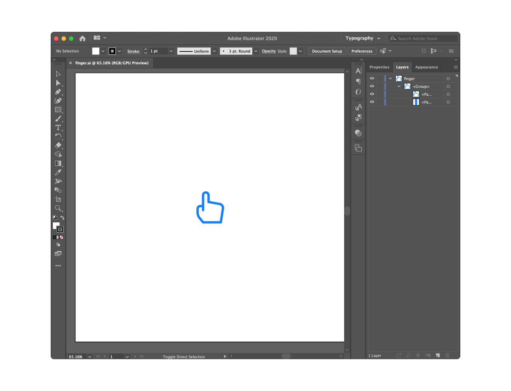
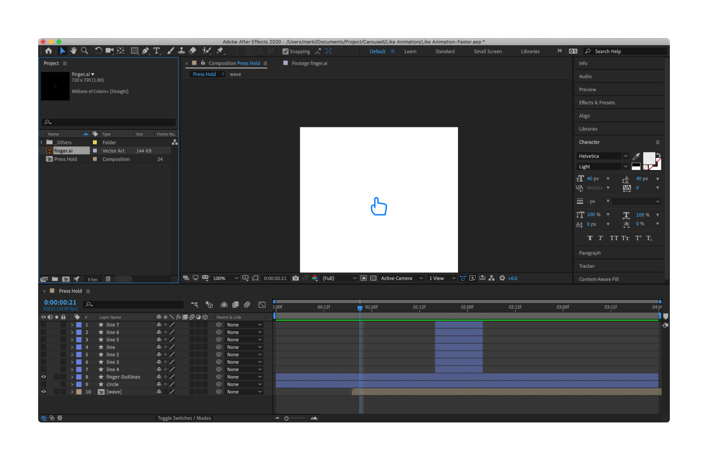
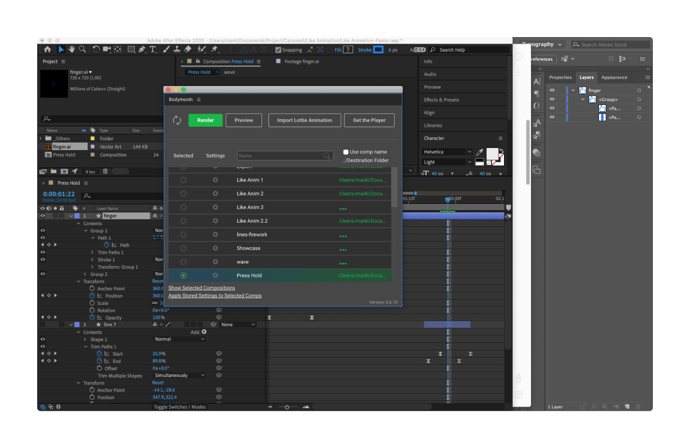
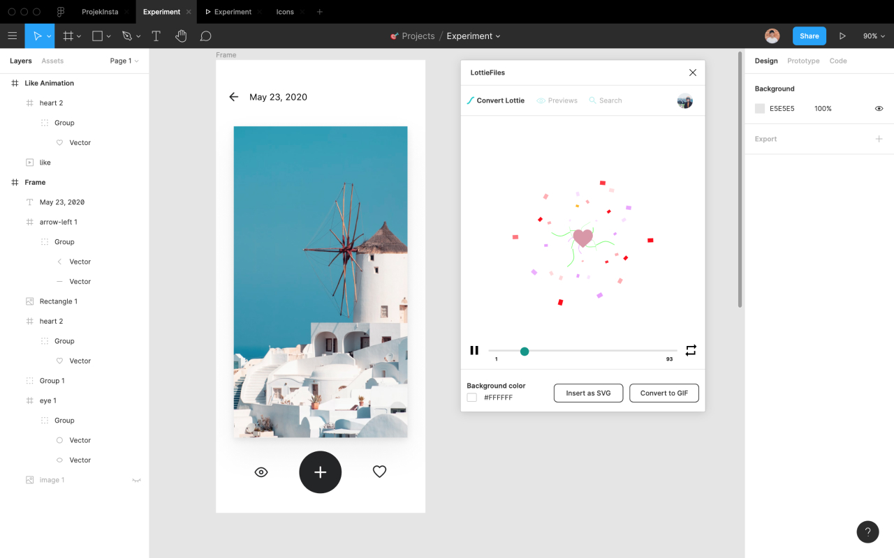
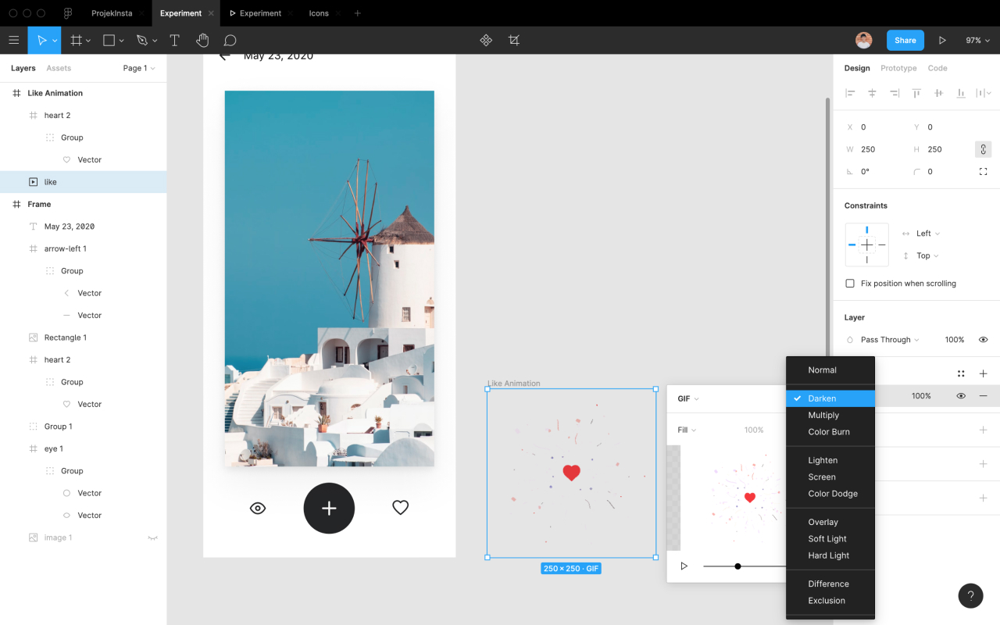
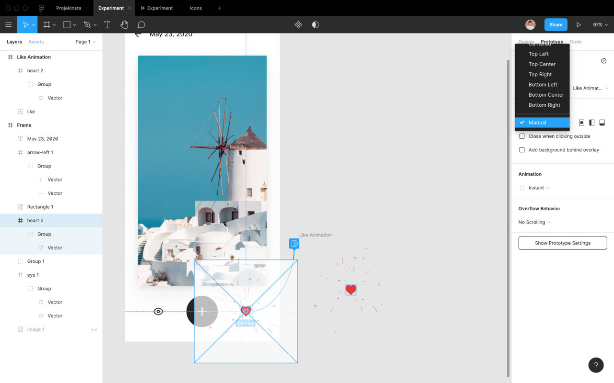
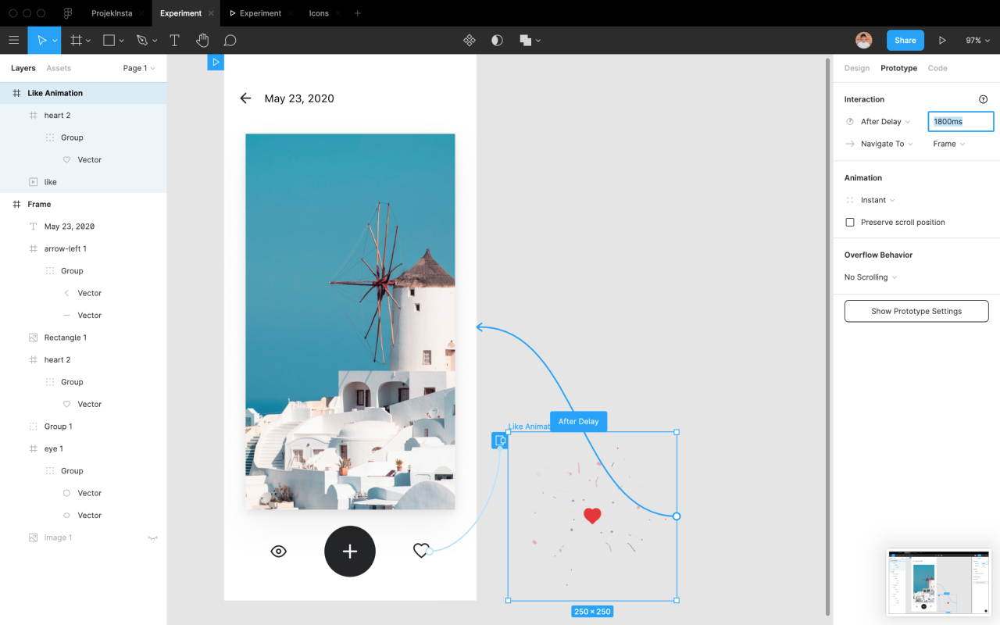

Everyone knows about Lottie from Airbnb (I guess!), so we don’t need a long introduction here. Just a short one:

> "Lottie helps us adding micro animation to the app much easier."

#### But why Lottie?
- Small file sizes.
- Scalable without pixelating.
- Easy for developers to implement.
- For all platforms: iOS, Android, Web.
- We, designers, control the quality of the animation.

#### Some definitions:
Just ensure that we are not getting confused (like me in the past).

- Lottie: a code library that renders animations from data files - JSON.
- BodyMovin: an After Effect plugin to render animations to JSON files.
- Lottiefiles: a community to share Lottie animations

<div class="Image__Small">
  
</div>

## Part 1: Create animation

On this part, we will go through the process of creating a Lottie animation: From After Effect to export handover files for developers.

When you know the basics of After Effect, you just need to install a plugin, then use it to export the animation to your developers.

It's easier than you think 😆

### Prepare
What do we need to get started with Lottie?

We need basic knowledge with After Effect (AE). Of course! If you don’t, I recommend watching some very **basic** AE animation to get started.

Then we need to install Bodymovin plugin in AE from [github.com/airbnb/lottie-web](https://github.com/airbnb/lottie-web). The easiest way is Option 3:
* Download the ZIP from the repo.
* Extract content and get the .zxp file from ‘/build/extension’
* Use the  [ZXP installer](http://aescripts.com/learn/zxp-installer/)  from aescripts.com.

#### After installing
Go to Adobe After Effects (or Edit in Windows) > Preferences > Scripting & Expressions… > and check on “Allow Scripts to Write Files and Access Network”.

Now let create our animation.

### 1. Design
Design your static illustration on Adobe Illustrator. (You can also do it on AE, but it’s easier to do in AI)

<div class="Image__Small">
  
</div>

### 2. Load assets
Create a new project in AE, doesn’t matter the size. Drag the AI file to AE. It will generate assets for us.

<div class="Image__Small">
  
</div>

### 3. Trace and animate.
Lottie animation is based on shape. So we have to generate shapes from our asset.
Tracing asset to shape: **Right click on the .ai file -> Create -> Create Shapes from Vector Layer**

Now animate them the way you want.

Support feature: solids, shape layers, masks, alpha mattes, trim paths, and dash patterns.

Checking airbnb.io/lottie for more features.

<div class="Image__Small">
  
</div>


### 4. Finish and Export
To export:
**Windows** -> **Externsions** -> **BodyMovin**

Select your animation composition -> Select destination -> Render

<div class="Image__Small">
  
</div>


Now we had a JSON file. Let’s test it in your prototype and send it to developers to add to the app.

---

## Part 2: Prototype in Figma
To ensure the animation work the way we want, creating prototypes is the fastest way to make the development process go smoothly.

### 1. JSON file
We need a JSON animation file. We can create one, or use one from lottifiles.com

I used the love animation from Aneesh Ravi.

P/S: Developers will use this JSON file to add animation to the iOS/Android app. 

<div class="Image__Small">
  
</div>


### 2. Load animation to Figma
Drag JSON file to LottieFile plugin to load animation. Click “Convert to GIF”.

<div class="Image__Small">
  
</div>


### 3. Add GIF / Animation
Create a frame, and insert the GIF. Adjust the size of the GIF to fit your design.
Change the Blending mode to **Darken** to hide the white background in the GIF.

<div class="Image__Small">
  
</div>


### 4. Create interaction
On the Prototype tab, create an interaction for the Like button to the GIF frame.

Select Open overlay -> Manual position -> Move it to the desired position.

Tips: Using arrow keyboards to move it so we can see the overlay background

<div class="Image__Small">
  
</div>


### 5. Create auto-go-back
On the GIF frame, adding an auto-go-back interaction to the main frame by selecting After a delay -> Add value (I use 1800ms)

<div class="Image__Small">
  
</div>


### 6. Run and test
Run prototype and test your animation. You can [try my Figma prototype](https://www.figma.com/proto/Q0FyKcUqOTWHvWOBDzokuW/Experiment?node-id=1%3A2&viewport=339%2C411%2C0.9507389068603516&scaling=scale-down) here and [duplicate my Figma file here](https://www.figma.com/file/Q0FyKcUqOTWHvWOBDzokuW/Experiment?node-id=1%3A2) if you need.

<div class="video">
  <video autoplay loop muted playsinline src="https://video.twimg.com/ext_tw_video/1266920382428135425/pu/vid/720x720/6QpTo-_1zuKc9jLl.mp4"></video>
</div>

### 7. Finish and Handover
Then just need to give the JSON file to developers and they can add animation easily.

Believe me, developers would love it.

#### P/S: Some tips on the micro animation:
- Keep the animation short. 1s or less.
- Keep a delay of 0.5s at the beginning of the reaction to allow a user's finger to leave the trigger. And they can see the animation
- Test it, until it “feels right”

---

## Part 3: Adding animation to our Web (GatsbyJS and React)

Now, we’ll be looking at how to use Lottie to add animations to our GatsbyJS / React applications. (By the way, my site is running on GatsbyJS).

### 1. Install Lottie for Web

We can install it right into our current project, or create a new react app for testing with NPM or yarn module.

`yarn add react-lottie`

For more info, [visit lottie web on Github](https://github.com/airbnb/lottie-web)

### 2. Add our animations.

Let’s create our basic component structure!

But first, we will need to acquire a JSON animation. You can create yourself like the previous steps, or try some free files from Lottiefiles. All we need is a JSON file.

I placed it into a subfolder called `asset-animation`.

After importing lottie and our JSON file, copy-paste the code below:


```
import React, { createRef, useEffect } from "react";
import lottie from 'lottie-web';

import animationData from '../asset-animation/city.json';

const Lottie = () => {
  
  let animationContainer = createRef();
  let anim = null;

  useEffect(() => {
    anim = lottie.loadAnimation({
      container: animationContainer.current,
      renderer: "svg",
      loop: true,
      autoplay: false,
      animationData: animationData
    });

    return () => anim.destroy(); // optional clean up for unmounting
  }, []);

  function handleStop() {
    anim.pause();
  }
  function handleStart() {
    anim.play();
  }

  return (
    <Layout>
      <SEO pathname={location.pathname} title={"About me"}/>
      <Section narrow >
        <HeadingContainer>
          <div onMouseEnter={handleStart} onMouseLeave={handleStop}>
            Hover me
            <HeroHeading ref={animationContainer}></HeroHeading>
          </div>
        </HeadingContainer>
      </Section>
    </Layout>
  );
};

export default Lottie;
``` 

The code is pretty simple. We import the lottie module first and then the animation JSON. We define our animation div wrapper. Then in the `useEffect`, we invoke the animation using the loadAnimation() function.

The loadAnimation() method accepts the following parameters. All details in the  [The docs](https://github.com/airbnb/lottie-web).

* animationData: an Object with the exported animation data.
* path: the relative path to the animation object. (animationData and path are mutually exclusive)
* loop: true / false / number
* autoplay: true / false it will start playing as soon as it is ready
* name: animation name for future reference
* renderer: ‘svg’ / ‘canvas’ / ‘html’ to set the renderer
* container: the dom element on which to render the animation

Okay! We are done, man! Now the animation is rendered as an SVG element on our website. [Try my file here](http://trongnguyen.co/animation).

I have to say this, I love SGVs! And SVG animation is the greatest thing ever.

The guide above is very basic. But that’s a good foundation we can use animation on the web.

I believe that after you see how our animation runs on our website, you will be excited and create more, customize more to fit your taste.

As a designer, I thought it was impossible, or it would take months to do it. But when I decided to do some research and try it, it’s easier than I think. Yeah, humans, we often exaggerate the fear.

---

Okay! It’s the complete guide for Lottie animation. From creating it to implement it to a website (I guess the same for iOS / Android / React Native).

Looking forward to seeing more micro-interactions on the web and any apps. Because it’s delightful.
