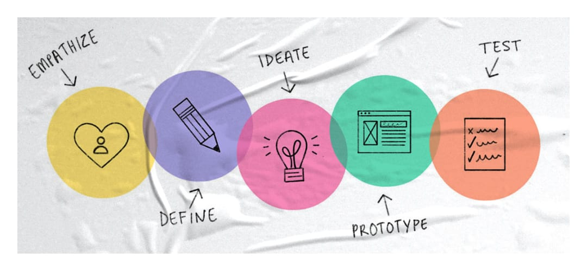

Product designer is a new term (not so new, but likely-new), and usually get confused with other roles like UX designer, web designer, app designer…

Who are they? And what are the differences between a product designer and a UX designer? Or nothing different?

And especially, how to get a job without going to design school? I got my job as a designer without going to design school. So, I’ll share my experience. Hopefully, it’s useful for someone who have just gots started in design or someone who wants to change career.

## But first, who the heck are product designers?
Have you ever heard somebody who called UX Designer, UI/UX Designer, Web Designer, App Designer, Product Designer, Interaction Designer,… and many more.

They are in different names, but the same. It depends on how companies call them. But at its core, they do the same thing:

> Solving people’s problems.

Their favorite process is Design Thinking

  

They usually get started with four disciplines:

* User experience (The way a product feels)
* Interaction (The way a product behaves)
* User interface (The way a product looks)
* Information architecture (The way the content is organized)

Know and practice these four and they will push you in the right direction.

## 2. Second, how to get a job as a designer without going to design school?

Many years ago, when I started doing design, it started as a hobby and I learned everything by myself.

If you any product designer how they started at design. The common answer is: 

> “I learned by myself.”

The best designers I know are also self-learners. This is a guide to teach yourself design.

### 1. Learn to see
Always start with the foundation.

Learn basic drawing so you can be comfortable sketching with a pen.

Learn graphic design theory: color, typography, grid,…

Learn some basics in user experience. Those books help: The design of everyday things, don’t make me think.

Learn how to write. Without words, apps would be an unusable jumble of shapes and icons.

### 2. Learn to make
When you’ve got a foundation, you’re ready to learn tools.

We have so many tools. Start with a pen, paper, Figma, Sketch, Adobe XD,… Whatever you like.

You will explore more tools while you’re learning, and find the best that works for you.

### 3. Copy from the best.
Don’t copy from one, copy from many of them.

As you copy things, you’ll start to understand why the designers did what they did, what principles underlie their works.

### 4. Build a portfolio
You don’t need to go to a fancy design school. But you do need a solid portfolio.

It doesn’t have to be real projects. Make up your own side projects. Here are a few ideas:

* Redesign poorly designed websites.
* Got an idea for an iPhone app? Mock it up.
* Help a friend to design an app.

### 5. Be confident.
This is critical.

Confidence gives you the courage to tell hiring managers why you’re worth it, what you’re worth, and what they are losing by not working with you.

Now go get your job. 

Once you’ve got it, keep learning. We are all life leaner.
