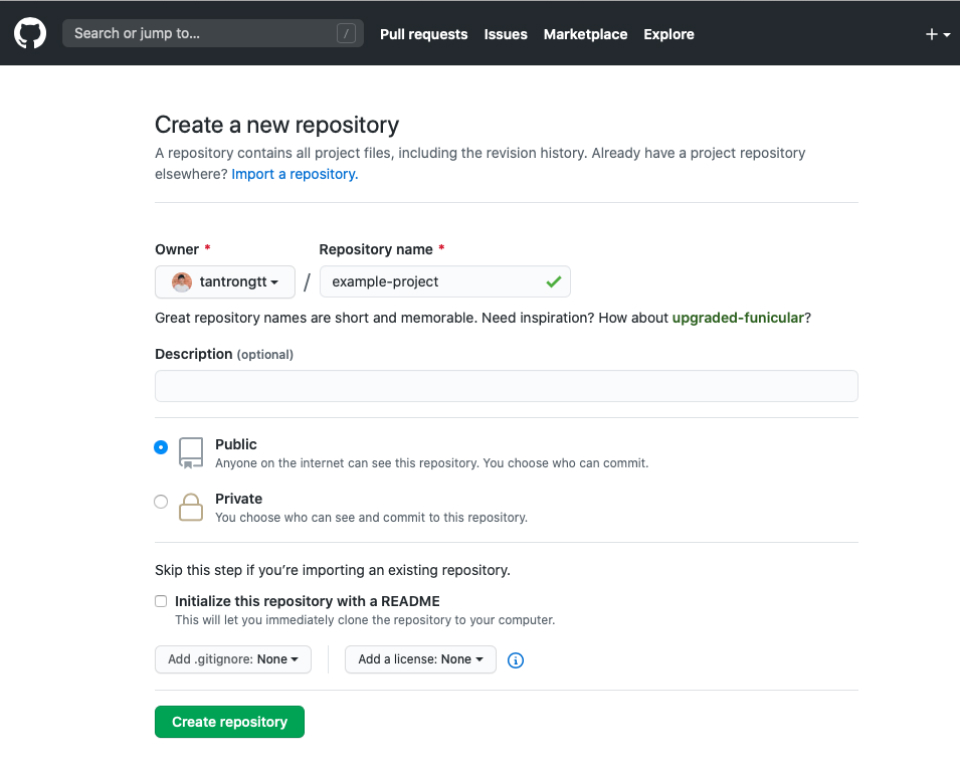
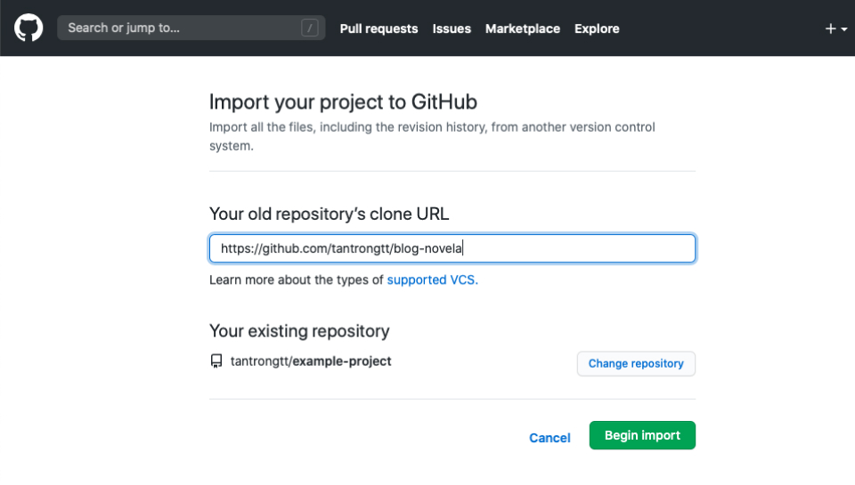
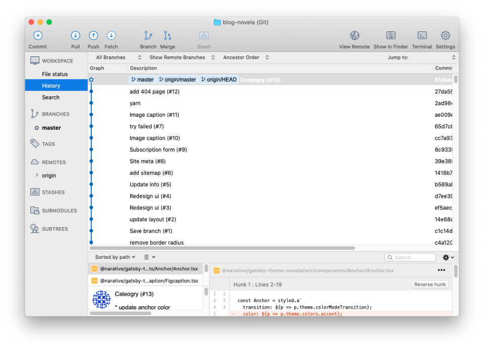
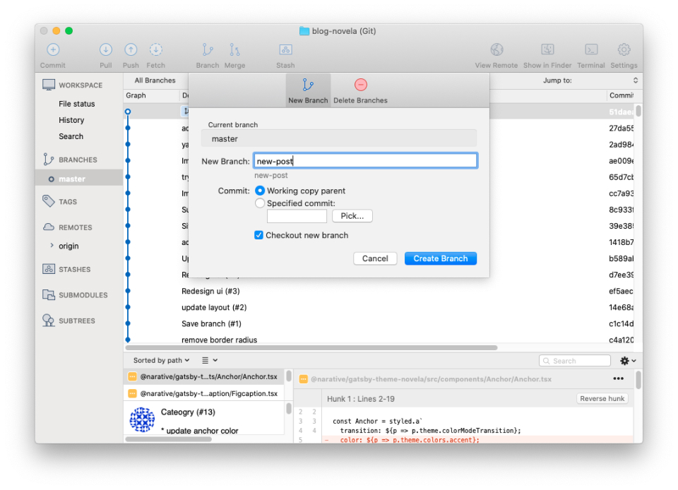
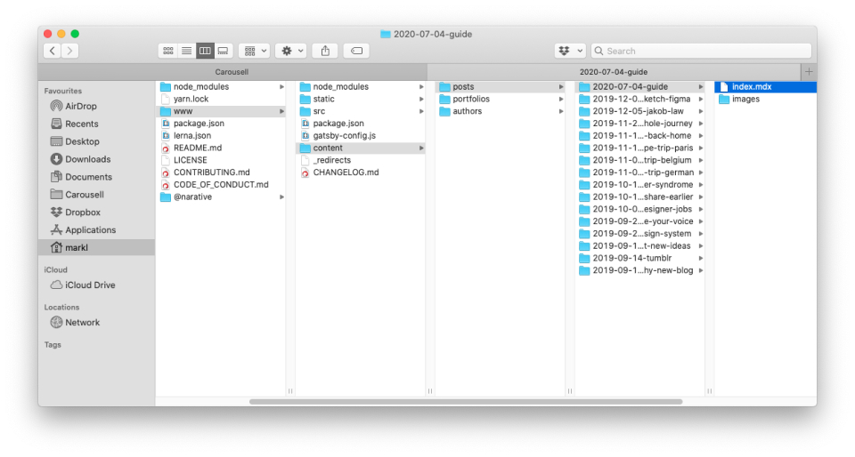
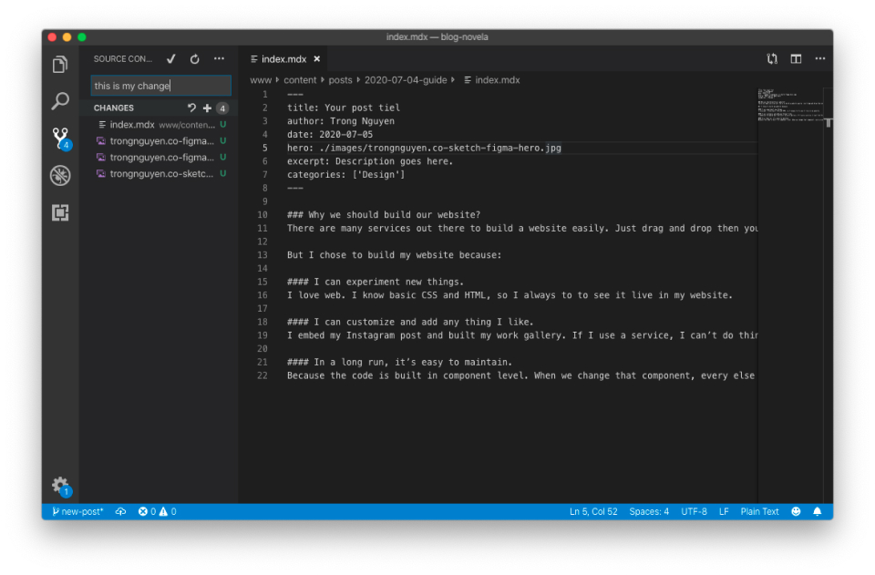
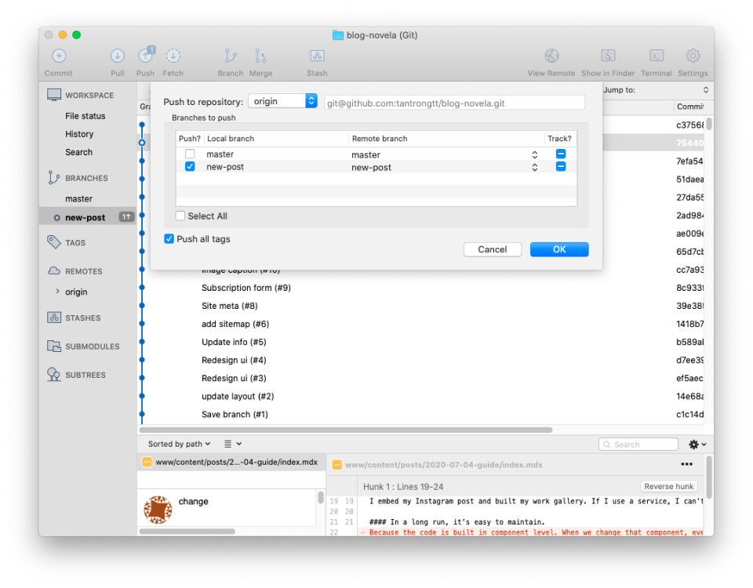
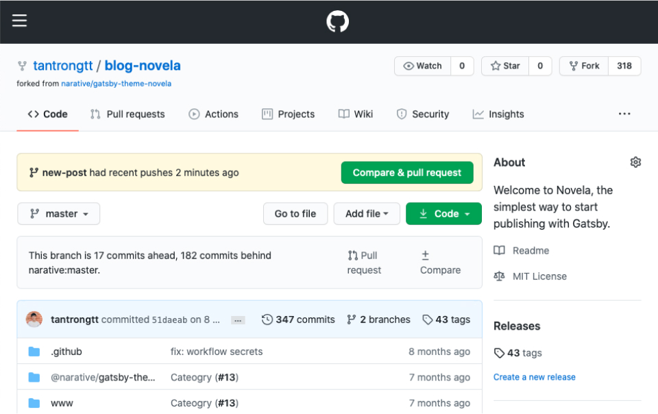
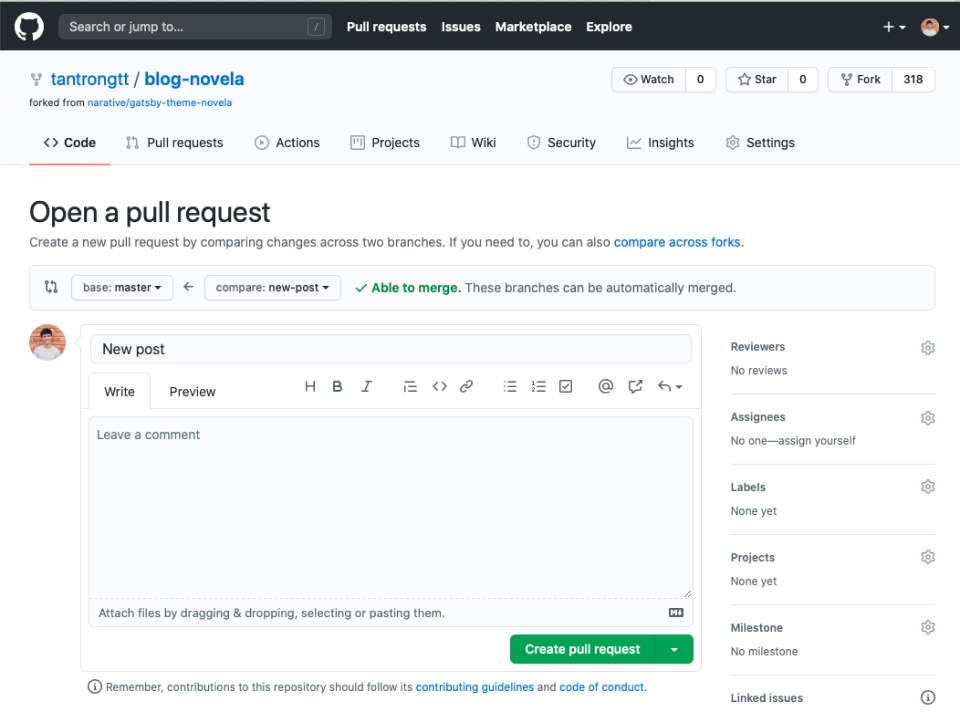
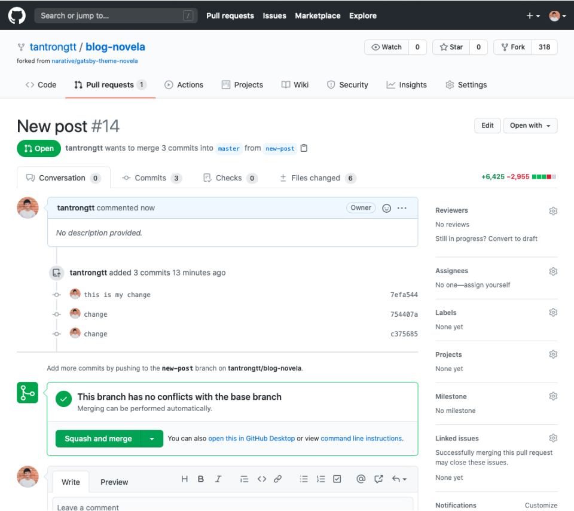

For who is curious about my website. It is built in GatsbyJS with Novela theme (a great them by the way). The code is hosted in Github. And I bought this domain trongnguyen.co from Godaddy.

In the past, I shared [this post](https://trongnguyen.co/how-i-built-a-new-website-in-2-weeks-with-gatsbyjs) to share how I built this site. It’s about the building process, nothing relates to technical. So if you want to see a general look, visit that post first then come back to this one later.

After I launch the site, I have received a couple of emails from people asking for help to build their website, like my website. I’m very happy to receive their emails. I made me feel that I’m useful to someone else.

Most of them are non-coding ones: designers who want to build their portfolio, entrepreneurs who want to build a website to start their business,…

It’s very challenging when building a website without base coding knowledge. Even with a ready-set template like Novela. But we also don’t need a deep knowledge of coding bo to build it. Some basic understanding of HTML, CSS, and Google is just enough.

So I write this guide to help people out there build their own website with Novela theme. If you are not familiar with code and want to have your site, this guide is for you. This is not for developers because it’s very basic.

In this post, we will go through 4 steps:

1. Setup/clone Novela project to your own Github
2. Customize your site (optional)
    1. How to build a custom page
    2. How to build a portfolio page
    3. How to build a page from a data file (*.yml)
3. Host your site with Gatsby
4. Change to your own domain

But first…

### Why we should build our website?
There are many services out there to build a website easily. Just drag and drop then you can have a good website in less than 1 hour. Just you need to pay a bit of money.

But I chose to build my website because:

#### I can experiment with new things.
I love the web. I know basic CSS and HTML, so I always want to see the code run and is live on my website.

#### I can customize and add anything I like.
I embed my [Instagram posts](https://trongnguyen.co/design-tips) and built [my work gallery](https://trongnguyen.co/gallery). If I use a service, I can’t do things like this.

#### In the long run, it’s easy to maintain.
Because the code is a built-in component level. When we change that component, every else will be updated accordingly.

Now let build our website by using the Novela theme.

For me, Novela the best free theme ever: beautiful in every pixel, carefully customized for desktop and mobile, and dark mode. And it came with very detailed documentation that guides us on how to use that theme.

---

## Create your ‘Novela’ project on Github
The first step is to set up your project.

Thanks for the Narrative team for sharing a great open-source Novela theme.

To leverage the whole project, I recommend to clone the whole project and use it for your website. So we can customize anything we like, from the base theme.

We use Github to store our code, control version, and later connect with Netlify to bring our website live. It’s free, and almost unlimited storage. Github is a great choice.

The easiest way to create your project on Github from the Novela project is to clone it.

Go to `Your repositories` and click `New` to create a new project.

  

After creating your project, go to the bottom and select `Import code` then paste the [Novela project URL](https://github.com/narative/gatsby-theme-novela) to clone. If you like my website, clone [my project](https://github.com/tantrongtt/blog-novela) which included portfolio and article pages.

On this guide, I used my website as starting.

  

Once you imported it to Github, clone it to your local machine and run it. If you know basic Git command, it would be much easier for you. But if you don’t, using a Git GUI app will make your process easier.

I’m using [Sourcetree](https://www.sourcetreeapp.com) to pull and push code. Download it and clone your Github project from Sourcetree.

  

After you cloned your project to your machine, time to run it. You just need to know two commands (thanks to developers who build Novela, all commands are ready setup).

Open terminal from Sourcetree and run those 2 commands:

`yarn`: To run the project the first time. This command is like the “Install” button when you install any app on your computer.

`yarn dev` to run the website on your computer. Once the command running, you can see your website from this URL
`http://localhost:8000/`

Yeah, you only need those two commands to run that project with your Terminal.

There are other commands to work with Git, one for adding changes you made in the project, one for upload code from your computer to Github,… But you don’t have to care about them. We can do all of it in Sourcetree and our code editor [VSCode](https://code.visualstudio.com).

This is my process every time I add a new post or make any change for my website.

#### 1. Create a new branch from master.
You can work directly on the master branch, but create a new branch will be safer. Because all the code in the master brand will be built to your live website. But with a different branch, you can control it.

  

#### 2. Open Terminal to run your project
Click on the ‘Terminal’ at the top right to open the terminal so you can run your project.

Once you install your project with `yarn`, the next time, we just need one command `yarn dev` to run it.

  

#### 3. Add a new post

Open your project from VSCode. Go to `/www/content/posts/`, add a new folder for your post. You can name that folder by date to make it more manageable.

  

Open the `index.mdx` page to add your post in a Markdown format. If you don’t know Markdown, google it. It’s very common. You just don’t pay attention to it.

Once you add your content, add that change to your Github by using VSCode UI (as I said, you don’t need to know that command)

  

#### 4. Push changes to Github
Once you commit changes, now we need to push those changes to Github.

If there are changes, Sourtree will show how many changes at the top left on the “Push” icon. Click that button to push your code to your Github.

  

#### 5. Merge your branch to the master branch

Go to your Github repo and merge your branch from there. Github provides simple UI to merge branch easier

  

  

  

When changes are merged to master, they are ready to live on your website.

The next step is to **Customize your site**, but it will be optional because it needs many customizations, and need some coding knowledge to do it. So I would skip this step to go to the next step: Make your website live on the internet with Netlfy.

### Related posts
- [How I built a new website in 2 weeks with GatsbyJS](https://trongnguyen.co/how-i-built-a-new-website-in-2-weeks-with-gatsbyjs)
