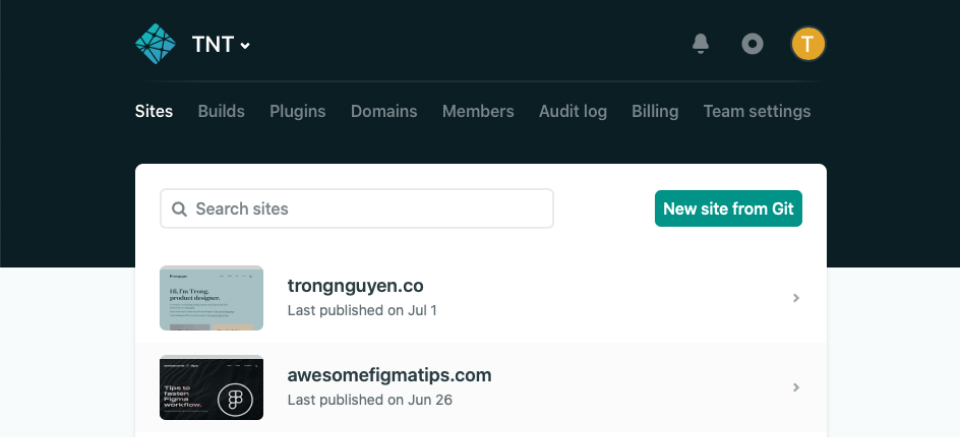
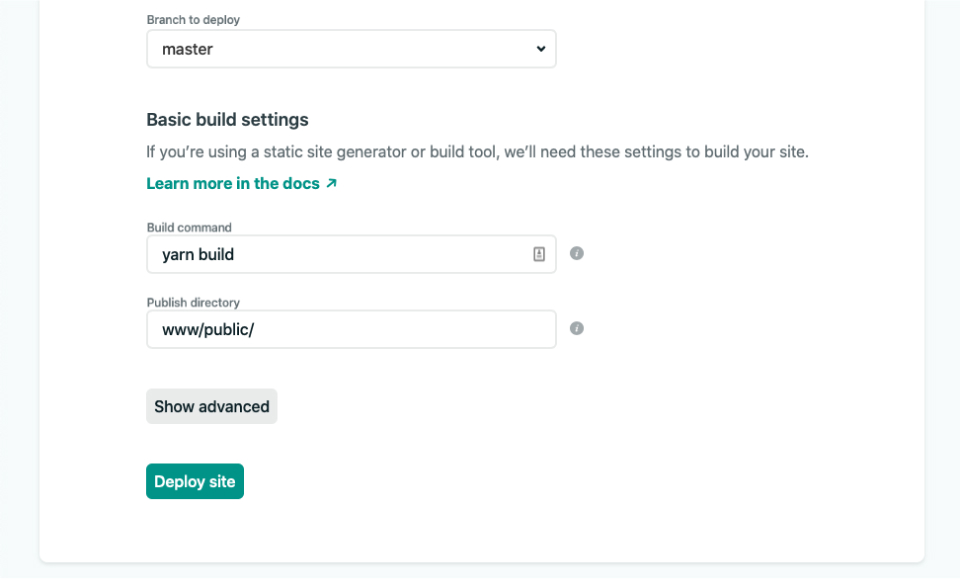
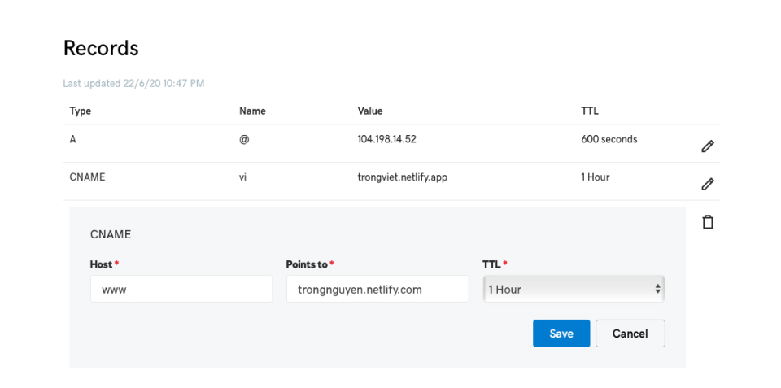
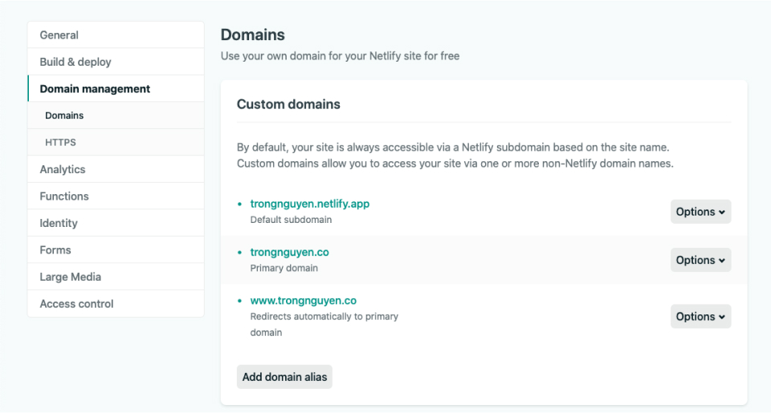

## Host your site with Netlify
When you finish this step, your website you be live, and you can see it from anywhere.

Go to [Netlify](https://www.netlify.com) and create a free account. Then start bringing your website online.

#### 1. Create a new site from Git

Click “New site from Git” to link your Github project with Netlify.

  

#### 2. Choose project.
We’re working the`example-project`, so I will select that one.

  

#### 3. Let Netlify know the build command
This is the critical step, most people don’t know about this.
So to run your Novela project, the Build command should be `yarn build`, the Publish directory should be `www/public/`

  

Then click the ‘Deploy site’ to deploy it.

Breathe in, wait, and enjoy your website. Netlify provides you a free domain, end with .netlify.app. You can change the prefix to any name you like. For example, I changed it to `trongnguyen.netlify.com`

The next step, you will change the domain to your one (e.g: trongnguyen.co)

---

## Change to your domain

You already own a free Netlify account, now is the time to use your own domain for your website.

You can buy your domain in any domain service then connect it to Netlify. The process to do it is the same.

### Point your Godaddy domain to your Netlify domain

In my case, I use Godaddy as a domain provider, so I will go through the process with Godaddy. If you use another service, you can use the same method.

Let say you already bought a domain in Godaddy. To connect your domain with Netlify, go to your Profile / Manage Domains / Manage DNS

In the CNAME row, click Edit and add those detail
- Host: www
- Point to: [your Netlify domain]. i.e: trongnguyen.netlify.com
- TTL: Doesn’t matter much. Just keep as default

Finally, click on ‘Save’ to save the change

  

### Add your Godaddy domain to Netlify

Now let’s go to your Netlify and add your custom domain.

Select your project and click ‘Domain Setting’. Here click on ‘Add domain alias’ to add your domain. In my case, I put trongnguyen.co

After you finish this step, you will see domains that are valid for your project.

  

Done! Your website is live now.

Now you have 	 website with an awesome domain. Time to customize any other detail you want, add your content, and continue building it.

I have to confess: after seeing my website live, I have more motivation to write, to experiment with things I love.

As Seth Godin said:

> ‘Learning how to make things turns you from a spectator into a participant, from someone at the mercy of the system to someone who is helping to run the system to someone system.
> Learning how to make gives you the guts to make more, to fail more often, to get better at making.’
> <cite>- Seth Godin, The Icarus Deception</cite>

---

This guide stops here. I mentioned on the first post about to through the Customization for your site, like building a custom page, build your portfolio page. But it’s very complicated and hard to understand. And I don’t know whether it useful or not.

If you really want to learn about it, drop a message to my email tantrongtt@gmail.com or [tweet me](https://twitter.com/trongawesome) on Twitter so I can someone need it and I will spend time to write it down.   

Finally, if you love my sharing and want to keep in touch, subscribe to my newsletter. I will send updates and post every two weeks.

Thanks,

Trong

### Related posts
- [Build your Website with Novela Gatsby - Episode 1](https://trongnguyen.co/build-your-website-with-novela-gatsby-episode-1)
- [How I built a new website in 2 weeks with GatsbyJS](https://trongnguyen.co/how-i-built-a-new-website-in-2-weeks-with-gatsbyjs)
- [GIF vs Video](https://trongnguyen.co/gif-vs-video)
- [Designer’s guide for designing for performance](https://trongnguyen.co/designer-s-guide-for-designing-for-performance-part-1)
